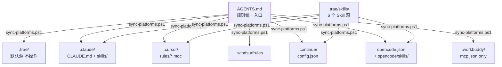

# 平台兼容性矩阵（Platform Compatibility Matrix）

> 本文档定义 RunFlowSkills 对各桌面 agent 平台的支持状态、安装差异、测试要求。
> 规则统一入口见根目录 [AGENTS.md](AGENTS.md)。

---

## 1. 支持矩阵

| 平台 | 规则入口 | Skill 路径 | MCP 配置 | 支持状态 | 优先级 |
|------|----------|------------|----------|----------|--------|
| Trae IDE CN | `AGENTS.md` + `.trae/` | `.trae/skills/<name>/SKILL.md` | `.trae/mcp.json` | ✅ 默认支持 | P0 |
| Claude Code | `AGENTS.md` + `CLAUDE.md` | `.claude/skills/<name>/SKILL.md` | `.mcp.json` | 🟡 同步脚本支持 | P1 |
| Cursor | `AGENTS.md` + `.cursor/rules/*.mdc` | `.cursor/rules/<skill>.mdc` | `.cursor/mcp.json` | 🟡 同步脚本支持 | P2 |
| Windsurf | `AGENTS.md` + `.windsurfrules` | `.windsurfrules`（合并） | `mcp_config.json` | 🟡 同步脚本支持 | P2 |
| Continue | `AGENTS.md` + `.continue/config.json` | `.continue/config.json`（索引） | `.continue/config.json` | 🟡 同步脚本支持 | P3 |
| OpenCode | `AGENTS.md`（自动读取） | `.opencode/skills/<name>/SKILL.md` | `opencode.json` | 🟡 同步脚本支持 | P2 |
| WorkBuddy | `AGENTS.md`（自动读取） | 不支持原生 Skill（Early Support） | `.workbuddy/mcp.json` | 🟡 同步脚本支持 | P3 |

**图例**：✅ 默认支持 / 🟡 通过同步脚本支持

**已放弃支持的平台**：
- ~~GitHub Copilot~~：不支持 MCP，无法满足项目核心架构
- ~~Aider~~：不支持原生 Skill 与 MCP，仅能读取规则

---

## 2. 单一事实源与镜像关系



**禁止**手动编辑镜像目录（`.claude/`、`.cursor/`、`.windsurfrules`、`.continue/`、`.opencode/`、`.workbuddy/`、`opencode.json`、`CLAUDE.md`、`.mcp.json`）。
所有变更必须先修改 `AGENTS.md` 或 `.trae/skills/`，再运行 `sync-platforms.ps1` 同步。

---

## 3. 各平台安装差异

### 3.1 Trae IDE CN（默认平台）

**前置依赖**：
- Python 3.12+
- uv（包管理器）

**安装步骤**：
```powershell
.\install.ps1
# Trae IDE CN 打开此文件夹 → 设置 → MCP → 启用「项目级 MCP」→ 重启
```

**MCP 配置位置**：`.trae/mcp.json`（使用 `${workspaceFolder}` 变量）

### 3.2 Claude Code

**前置依赖**：
- Python 3.12+
- uv 或 pip
- Claude Code CLI

**安装步骤**：
```powershell
# 1. 安装 Python 依赖
uv sync --directory run-flow-skills-mcp
# 或：pip install -e ./run-flow-skills-mcp

# 2. 同步平台镜像
.\scripts\sync-platforms.ps1 -Platforms claude-code

# 3. 在 Claude Code 启用项目（claude /open 自动读取 .mcp.json）
```

**MCP 配置位置**：`.mcp.json`（绝对路径）

### 3.3 Cursor

**前置依赖**：
- Python 3.12+
- uv
- Cursor IDE

**安装步骤**：
```powershell
uv sync --directory run-flow-skills-mcp
.\scripts\sync-platforms.ps1 -Platforms cursor
# Cursor 设置 → MCP → 启用项目级 MCP
```

**MCP 配置位置**：`.cursor/mcp.json`

### 3.4 Windsurf

**前置依赖**：
- Python 3.12+
- uv
- Windsurf IDE

**安装步骤**：
```powershell
uv sync --directory run-flow-skills-mcp
.\scripts\sync-platforms.ps1 -Platforms windsurf
```

**MCP 配置位置**：`mcp_config.json`（项目根目录）

### 3.5 Continue

**前置依赖**：
- Python 3.12+
- uv
- Continue 插件（VSCode/JetBrains）

**安装步骤**：
```powershell
uv sync --directory run-flow-skills-mcp
.\scripts\sync-platforms.ps1 -Platforms continue
```

**MCP 配置位置**：`.continue/config.json`

### 3.6 OpenCode

**前置依赖**：
- Python 3.12+
- uv
- OpenCode CLI（[opencode.ai](https://opencode.ai)）

**安装步骤**：
```powershell
uv sync --directory run-flow-skills-mcp
.\scripts\sync-platforms.ps1 -Platforms opencode
# 在项目目录运行 `opencode`，自动读取 opencode.json 与 AGENTS.md
```

**MCP 配置位置**：`opencode.json`（项目根目录）

**OpenCode 特定约定**：
- 不支持 `${workspaceFolder}`，配置中强制使用绝对路径
- MCP 结构为 `{"mcp": {"server-name": {"type": "local", "command": [...], "enabled": true}}}`
- Skills 目录：`.opencode/skills/<name>/SKILL.md`（复数形式 `skills/`）
- AGENTS.md 自动被 OpenCode 读取，无需额外声明
- 可在 opencode.json 的 `instructions` 字段引用额外规则文件

### 3.7 WorkBuddy

**前置依赖**：
- Python 3.12+
- uv
- WorkBuddy 客户端

**安装步骤**：
```powershell
uv sync --directory run-flow-skills-mcp
.\scripts\sync-platforms.ps1 -Platforms workbuddy
# WorkBuddy 打开此文件夹，自动读取 .workbuddy/mcp.json 与 AGENTS.md
```

**MCP 配置位置**：`.workbuddy/mcp.json`

**WorkBuddy 特定约定**：
- Early Support 阶段：**仅支持 MCP，不支持原生 Skills**
- 同步脚本仅生成 `.workbuddy/mcp.json`，不生成 Skill 镜像
- 规则通过根目录 `AGENTS.md` 传递（WorkBuddy 自动读取）

---

## 4. 平台专有依赖与抽象层

| 依赖项 | 类型 | 影响范围 | 抽象方案 |
|--------|------|----------|----------|
| `.trae/` 目录命名 | Trae 专属 | Skill/Rules 路径 | 保留为默认源；其他平台由 `sync-platforms.ps1` 生成镜像 |
| `${workspaceFolder}` 变量 | VSCode/Trae 风格 | `.trae/mcp.json` | `generate-mcp-config.ps1` 按平台替换为绝对路径 |
| OpenCode 不支持 `${workspaceFolder}` | OpenCode 专属 | `opencode.json` | 同步脚本强制写入绝对路径 |
| OpenCode MCP 结构 `{type,command[],enabled}` | OpenCode 专属 | `opencode.json` 字段格式 | 同步脚本生成 OpenCode 专用结构 |
| WorkBuddy 仅支持 MCP | WorkBuddy Early Support | 无 Skill 镜像 | 同步脚本仅生成 `.workbuddy/mcp.json` |
| `uv run --directory` | uv 专属 | MCP 启动命令 | `generate-mcp-config.ps1 -PythonRunner python` 提供 `python -m` 备选 |
| Python 3.12+ | 版本约束 | 用户环境 | 评估降至 3.10+（需 pydantic v2 + `match` 语法兼容性测试） |
| `install.ps1/.sh` 假设 uv | 安装脚本 | 首次部署 | 待增加 `--no-uv` 分支（pip 路径） |
| FastAPI + uvicorn | Web 可视化 | 仅 `/coach` 等需要 Web | 已隔离在 `run_flow_skills_mcp/web/`，CLI 用户可不开 |

---

## 5. 跨平台测试要求

### 5.1 测试分层

| 层级 | 范围 | 工具 | 频率 |
|------|------|------|------|
| L1 单元测试 | Python 计算/解析逻辑 | pytest | 每次提交 |
| L2 集成测试 | MCP Tool 调用链 | pytest + httpx | 每次提交 |
| L3 平台静态校验 | 各平台配置文件存在性与格式 | pytest（参数化） | 每次提交 |
| L4 平台 E2E | 真实平台加载 Skill 并执行 | Playwright（仅 Trae） | 发布前 |
| L5 跨平台冒烟 | 同步脚本生成结果验证 | PowerShell + pytest | 发布前 |

### 5.2 平台静态校验测试

```python
# tests/test_platform_compatibility.py
@pytest.mark.parametrize("platform", [
    "trae", "claude-code", "cursor", "windsurf", "continue", "opencode", "workbuddy"
])
def test_rules_entry_point_exists(platform):
    """每个目标平台的规则入口文件必须存在"""

@pytest.mark.parametrize("platform", ["trae", "claude-code", "cursor", "opencode", "workbuddy"])
def test_mcp_config_valid(platform):
    """每个平台的 MCP 配置必须可解析且启动命令存在"""

@pytest.mark.parametrize("skill", ["import", "analyze", "plan", "review", "coach", "stats"])
def test_skill_frontmatter_complete(skill):
    """每个 Skill frontmatter 必须含 name/version/description/allowed-tools/inputs/outputs"""

def test_agents_md_rules_coverage():
    """AGENTS.md 必须引用全部 5 个规则章节（计算/分析/教练/数据安全/交互）"""

def test_no_platform_specific_agent_dirs():
    """禁止存在 .trae/agents/、.claude/agents/ 等平台专有 agent 目录"""
```

### 5.3 已知限制

- **WorkBuddy** 处于 Early Support 阶段，仅支持 MCP，不支持原生 Skills
- **Cursor** 不支持原生 Skill 调度，需通过 `.cursor/rules/*.mdc` 模拟
- **Continue** Skill 路径在 config.json 中引用，需 Continue 插件支持
- **OpenCode** 不支持 `${workspaceFolder}` 变量，必须使用绝对路径

---

## 6. 镜像目录 .gitignore 策略

**镜像目录入库策略**（开箱即用）：

```gitignore
# === Agent 平台镜像目录入库（不忽略，便于开箱即用）===
# .claude/、.cursor/、.windsurfrules、.continue/、.opencode/、.workbuddy/
# opencode.json、CLAUDE.md、.mcp.json 均提交到 Git

# === Trae 源目录入库（保留为默认平台）===
!.trae/
!.trae/skills/
!.trae/mcp.json
```

**理由**：
- 用户下载项目后无需运行同步脚本即可在任一支持平台使用
- 镜像目录由 `sync-platforms.ps1` 统一生成，开发者修改源后需重新同步并提交
- 避免用户首次使用时遇到"未生成镜像"导致平台无法识别项目

---

## 7. 变更记录

| 版本 | 日期 | 变更 |
|------|------|------|
| 1.0.0 | 2026-07-26 | 初始版本：定义 5 平台支持矩阵、安装差异、测试要求 |
| 1.1.0 | 2026-07-26 | 移除 GitHub Copilot / Aider 支持；新增 OpenCode / WorkBuddy 平台；镜像目录入库策略 |
