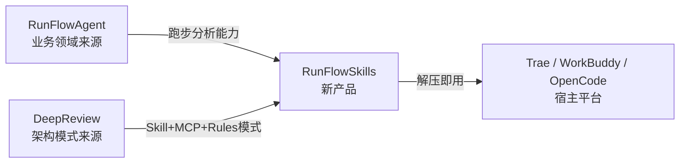
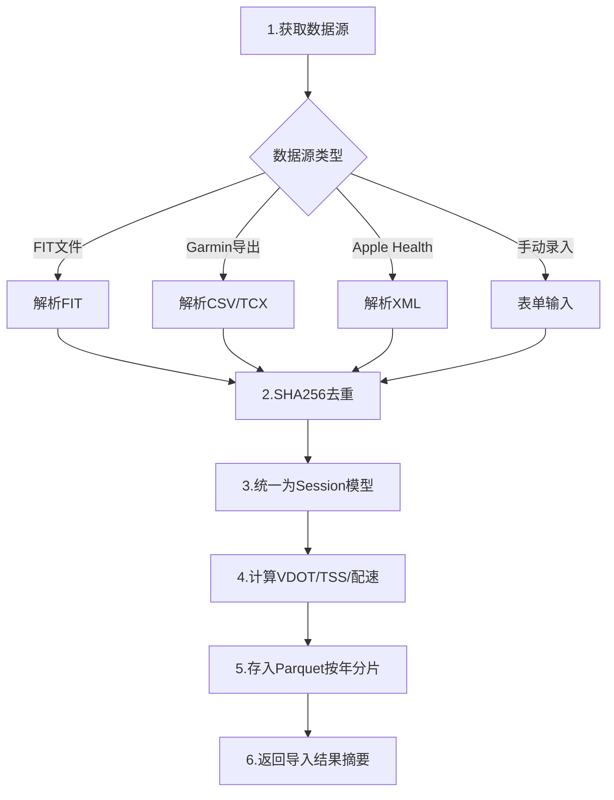

# RunFlowSkills 用户需求文档

| 项目 | 内容 |
|------|------|
| 产品名称 | RunFlowSkills（深度跑步分析 Skills 套件） |
| 文档版本 | v1.0 |
| 编制日期 | 2026-07-25 |
| 架构模式 | 复用 DeepReview「文件夹即产品 + Skill + MCP + Rules + Web 可视化」模式 |
| 业务领域 | 复用 RunFlowAgent 跑步数据分析能力（VDOT/TSS/数字孪生/进化引擎） |

---

## 目录

- [一、产品定位](#一产品定位)
- [二、目标用户画像](#二目标用户画像)
- [三、核心使用场景](#三核心使用场景)
- [四、功能需求（按 Skill 组织）](#四功能需求按-skill-组织)
- [五、数据需求](#五数据需求)
- [六、交互需求](#六交互需求)
- [七、业务规则约束](#七业务规则约束)
- [八、非功能需求](#八非功能需求)
- [九、差异化价值](#九差异化价值)
- [十、范围边界](#十范围边界)
- [十一、验收标准](#十一验收标准)

---

## 一、产品定位

### 1.1 一句话定位

**「严肃跑者的本地数据主权工具 + 可审计 AI 教练」——一个文件夹，在 Trae/WorkBuddy/OpenCode 中打开即用，通过 Skill + MCP 完成跑步数据导入、深度分析、训练计划生成、AI 教练咨询。**

### 1.2 与 RunFlowAgent / DeepReview 的关系



- **从 RunFlowAgent 继承**：VDOT/TSS/CTL/ATL 计算、数字孪生、进化引擎、ML 预测、AI 决策透明化、Parquet 存储——业务领域知识
- **从 DeepReview 继承**：四层架构（交互/Skills/MCP/Rules）、解压即用、Skill 驱动工作流、本地优先、降级方案、用户确认机制——产品形态
- **与两者的区别**：RunFlowAgent 是 CLI/WebUI 应用（重前端），DeepReview 是错题工具（教育领域），RunFlowSkills 是**纯 Skill+MCP 服务**（跑步领域，无重前端，宿主平台即 UI）

### 1.3 核心价值主张

| 价值点 | 说明 | 对应竞品短板 |
|--------|------|------------|
| **数据主权** | 本地 Parquet 存储，一键全量导出，零数据出境 | Strava/Garmin 数据锁定 |
| **可审计 AI** | 每条 AI 建议附「为什么」决策溯源链 | 所有竞品 AI 黑箱 |
| **多硬件中立** | 聚合 Garmin/COROS/Apple Health/FIT 文件，不绑定品牌 | 硬件厂商围墙花园 |
| **宿主原生体验** | 在用户已有的 AI 对话环境中使用，无需安装新 App | 独立 App 获客成本高 |

### 1.4 不做什么（反向定位）

- ❌ 不做 GPS 跑步记录器（手表已覆盖）
- ❌ 不做跑步社交网络（Strava 已垄断）
- ❌ 不做重前端 WebUI（DeepReview 的 Web 可视化是可选的薄层，RunFlowSkills 优先用宿主对话）
- ❌ 不做云端账号体系（本地优先是核心卖点）

---

## 二、目标用户画像

### 2.1 主力用户：严肃跑者 + 极客

| 维度 | 描述 |
|------|------|
| **跑龄** | ≥2 年，有结构化训练习惯 |
| **周跑量** | 40–80km |
| **目标** | 半马/全马 PR（破 4/破 330/破 3） |
| **装备** | 有 GPS 手表（Garmin/COROS/Apple Watch），用 Strava/悦跑圈/RQrun 记录 |
| **痛点** | ① 数据分散在多个平台，无法聚合分析 ② 现有 App 分析深度不足（只有图表没有洞见）③ AI 建议是黑箱，不知道「为什么这么建议」④ 数据被平台锁定，无法导出 |
| **技术能力** | 能用命令行/愿意在 Trae 中操作，或通过 WorkBuddy 自然语言使用 |
| **付费意愿** | 愿意为「深度分析 + AI 教练」付费 ¥99–199/年（待 PSM 调研验证） |

### 2.2 次要用户：跑步教练

| 维度 | 描述 |
|------|------|
| **场景** | 管理多名跑者训练数据，批量生成计划 |
| **痛点** | Excel 管理低效，专业工具（TrainingPeaks $19.99/月）贵且非中文 |
| **需求** | B2B 方向，复用 subagent 架构（coach 角色）管理多跑者 |
| **优先级** | P2，MVP 后再考虑 |

### 2.3 非目标用户

- 纯休闲跑者（周跑量 <20km，无结构化训练）——他们用 Keep/悦跑圈足够
- 走走跑跑的健身人群——不是严肃训练场景

---

## 三、核心使用场景

### 3.1 场景一：周度训练复盘（最高频）

> **用户故事**：作为严肃跑者，我每周日晚上想回顾本周训练负荷，了解 TSS/CTL/ATL 趋势，判断下周该加量还是减量。

**当前痛点**：打开 Garmin Connect 看 CTL 曲线，但不知道「CTL 65 意味着什么」「下周该跑多少」。

**RunFlowSkills 体验**：
```
用户：/review
RunFlowSkills：[调用 review Skill]
       → 导入本周 FIT 文件（如未导入）
       → 计算 TSS/CTL/ATL/TSB
       → 对比上周负荷变化
       → AI 解读：「本周 CTL 65（+3），ATL 58（+8），TSB +7。
         急性负荷上升较快，建议下周减量 15% 防过度训练。」
       → 附决策溯源链（基于哪些数据得出此结论）
```

### 3.2 场景二：比赛目标设定与计划生成

> **用户故事**：我想在 12 周后全马破 4，需要一个可执行的训练计划。

**当前痛点**：RQrun/Runna 的计划是黑箱，不知道为什么安排某个课表；漏练一次后计划不会自适应调整。

**RunFlowSkills 体验**：
```
用户：/plan 全马破4 12周
RunFlowSkills：[调用 plan Skill]
       → 基于当前 VDOT 评估能力差距
       → 生成 12 周周期化计划（基础期/进展期/巅峰期/减量期）
       → 每周课表含配速区间（E/M/T/I/R）
       → AI 说明：「你的 VDOT 42，全马破4需要 VDOT ≥43.5，
         12 周可达成但需保持周跑量 60km+」
       → 漏练时自动重算后续负荷分配
```

### 3.3 场景三：AI 教练咨询（差异化核心）

> **用户故事**：我今早 HRV 偏低，想知道今天该不该跑间歇。

**当前痛点**：问 ChatGPT 它不知道我的数据；问 Garmin 它只会说「恢复不足」但不给具体建议。

**RunFlowSkills 体验**：
```
用户：今天能跑间歇吗？
RunFlowSkills：[调用 coach Skill]
       → 读取今日 HRV/静息心率/睡眠数据
       → 读取近 7 天训练负荷
       → AI 判断：「今日 HRV 比基线低 12ms（-15%），
         且昨跑了 T5 间歇，建议今天 E 区间 30 分钟轻松跑，
         间歇推迟到周四。」
       → 附 transparency 溯源：
         数据依据 [HRV 38ms, 基线 45ms, 昨日 TSS 120]
         判断逻辑 [HRV 偏离 >10% + 24h 内高强度 → 减量]
```

### 3.4 场景四：What-If 推演（独占功能）

> **用户故事**：如果我把周三间歇换成 tempo，全马能快几分钟？

**当前痛点**：没有任何竞品支持「假设性训练推演」。

**RunFlowSkills 体验**：
```
用户：如果我把周三的间歇换成 tempo，全马能快多少？
RunFlowSkills：[调用 twin Skill]
       → 加载个人数字孪生
       → 模拟替换课表后的训练负荷演变
       → 预测 12 周后 VDOT 变化
       → 「替换后周负荷下降 8%，VDOT 预测 43.2（原 43.5），
         全马预计慢 1 分 30 秒。间歇对 VO2max 提升更关键，
         不建议替换。」
```

### 3.5 场景五：数据导入与聚合（基础场景）

> **用户故事**：我有 Garmin 手表和 Apple Watch，想把两边数据合并分析。

**当前痛点**：Garmin 数据在 Garmin Connect，Apple 数据在 Apple Health，无法跨平台聚合。

**RunFlowSkills 体验**：
```
用户：/import
RunFlowSkills：[调用 import Skill]
       → 支持 FIT 文件 / Garmin 导出 / Apple Health 导出 / 手动录入
       → SHA256 去重（同一活动不重复导入）
       → 统一为 Parquet 格式存储
       → 自动计算 VDOT/TSS 并入库
```

---

## 四、功能需求（按 Skill 组织）

> 参照 DeepReview 模式：每个核心场景对应一个 Skill，Skill 编排 MCP Tools 完成工作流。

### 4.1 Skill 总览

| Skill | 命令 | 触发关键词 | 核心工作流 |
|-------|------|-----------|-----------|
| 跑步数据导入 | `/import` | 导入/上传/同步 | FIT解析 → 去重 → 存储 → 计算指标入库 |
| 训练分析 | `/analyze` | 分析/负荷/VDOT/HRV | 查询数据 → 计算 → AI 解读 → 溯源 |
| 训练计划 | `/plan` | 计划/课表/目标 | VDOT评估 → 生成计划 → 自适应调整 |
| 训练复盘 | `/review` | 复盘/总结/本周/本月 | 聚合周期数据 → 趋势对比 → AI 总结 |
| AI教练咨询 | `/coach` | 能不能跑/今天怎么练/感觉累 | 读取身体信号 → 综合判断 → 带溯源建议 |
| 数字孪生推演 | `/twin` | 如果/假设/what-if | 加载孪生 → 模拟 → 预测 → 对比 |
| 统计导出 | `/stats` | 统计/分布/导出 | 多维聚合 → 可视化 → 导出 |

### 4.2 各 Skill 详细需求

#### 4.2.1 跑步数据导入 Skill

**对应 MCP Tools**：`import_fit`, `import_garmin_export`, `import_apple_health`, `query_sessions`, `deduplicate_sessions`

**工作流**：



**需求项**：
- **FR-IMPORT-01**：支持 FIT 文件导入（fitparse 解析）
- **FR-IMPORT-02**：支持 Garmin Connect 数据导出（CSV/TCX）
- **FR-IMPORT-03**：支持 Apple Health 数据导出（XML）
- **FR-IMPORT-04**：支持手动录入单次跑步（距离/时长/心率/配速）
- **FR-IMPORT-05**：SHA256 去重，同一活动不重复导入
- **FR-IMPORT-06**：导入后自动计算 VDOT（距离 ≥1500m 时）、TSS、配速、心率区间分布
- **FR-IMPORT-07**：存储为 Parquet 按年分片（复用 RunFlowAgent 存储方案）
- **FR-IMPORT-08**：批量导入支持（多文件）
- **FR-IMPORT-09**：导入失败时给出明确原因（文件格式错误/数据不完整/重复导入）
- **FR-IMPORT-10**：支持 `--force` 强制重新导入已存在活动

#### 4.2.2 训练分析 Skill

**对应 MCP Tools**：`calc_vdot`, `calc_training_load`, `calc_hrv`, `analyze_fatigue`, `get_trends`

**工作流**：
1. 查询指定时间范围的 Session 数据
2. 计算 VDOT（Powers 方法，距离 ≥1500m）
3. 计算 TSS/CTL（42天 EWMA）/ATL（7天 EWMA）/TSB
4. 计算 HRV 趋势/静息心率/心率漂移
5. 评估疲劳度与过度训练风险
6. AI 综合解读 + 决策溯源

**需求项**：
- **FR-ANALYZE-01**：VDOT 计算遵循 Powers 方法，距离 <1500m 时标记为「估算」
- **FR-ANALYZE-02**：TSS = 时长 × IF² × 100（IF 基于乳酸阈值心率或配速）
- **FR-ANALYZE-03**：CTL = 42 天 EWMA，ATL = 7 天 EWMA，TSB = CTL - ATL
- **FR-ANALYZE-04**：HRV 分析支持 RMSSD/SDNN/pNN50 指标，计算个人基线与偏离度
- **FR-ANALYZE-05**：疲劳度评估综合 HRV 偏离 + CTL/ATL 比值 + RPE 趋势
- **FR-ANALYZE-06**：支持按天/周/月/年维度查看趋势
- **FR-ANALYZE-07**：AI 解读必须附决策溯源（数据依据 + 判断逻辑）
- **FR-ANALYZE-08**：所有计算结果输出为结构化 JSON，便于 Agent 解读
- **FR-ANALYZE-09**：配速格式 M'SS"/km，时长格式 HH:MM:SS（业务约束）

#### 4.2.3 训练计划 Skill

**对应 MCP Tools**：`generate_plan`, `adjust_plan`, `query_plan`, `eval_plan_fidelity`

**工作流**：
1. 评估当前 VDOT 与目标差距
2. 计算所需训练周期长度
3. 生成周期化计划（基础期/进展期/巅峰期/减量期）
4. 每周课表含配速区间（E/M/T/I/R）+ 时长 + 心率区间
5. 用户确认后保存
6. 执行中根据实际完成情况自适应调整

**需求项**：
- **FR-PLAN-01**：支持目标类型：全马/半马/10K/5K + 目标时间
- **FR-PLAN-02**：周期划分遵循 Jack Daniels 体系（5 阶段）
- **FR-PLAN-03**：配速区间基于个人 VDOT 计算（E=59-74% VDOT, M=75-84%, T=88-100%, I=95-100%, R=100-110%）
- **FR-PLAN-04**：计划生成后必须用户确认才保存
- **FR-PLAN-05**：漏练检测——计划中未完成的活动触发重算
- **FR-PLAN-06**：自适应调整遵循「负荷守恒」原则（漏一次不追加，而是重新分配后续负荷）
- **FR-PLAN-07**：执行忠实度评估（实际 vs 计划的偏离度）
- **FR-PLAN-08**：计划可导出为 ICS 日历格式

#### 4.2.4 训练复盘 Skill

**对应 MCP Tools**：`get_period_summary`, `compare_periods`, `get_insights`

**工作流**：
1. 确定复盘周期（本周/本月/自定义）
2. 聚合周期内所有 Session
3. 计算周期指标（总跑量/总 TSS/平均 VDOT/负荷变化）
4. 对比上一周期趋势
5. AI 生成结构化复盘报告（成绩/问题/建议）

**需求项**：
- **FR-REVIEW-01**：支持周/月/季/年维度复盘
- **FR-REVIEW-02**：复盘报告含：跑量统计、负荷变化、VDOT 趋势、HRV 趋势、伤病风险、下周建议
- **FR-REVIEW-03**：趋势对比支持环比（vs 上周期）和同比（vs 去年同期）
- **FR-REVIEW-04**：AI 复盘必须具体到数据，禁止笼统结论（「训练不错」不合规）
- **FR-REVIEW-05**：复盘报告可导出为 Markdown

#### 4.2.5 AI 教练咨询 Skill（差异化核心）

**对应 MCP Tools**：`read_body_signals`, `evaluate_readiness`, `recommend_workout`, `get_decision_trace`

**工作流**：
1. 读取当日身体信号（HRV/静息心率/睡眠/疲劳度）
2. 读取近期训练负荷（7 天 ATL, 42 天 CTL）
3. 评估就绪状态（green/yellow/red）
4. 生成当日训练建议（类型 + 强度 + 时长 + 配速）
5. 附决策溯源链（数据依据 + 判断逻辑 + 置信度）

**需求项**：
- **FR-COACH-01**：就绪状态评估综合 HRV 偏离度 + TSB + RPE 趋势
- **FR-COACH-02**：建议必须具体可执行（「跑 30 分钟」不合规，必须「E 区间 30 分钟，配速 5'40"-6'00"/km」）
- **FR-COACH-03**：决策溯源链包含：输入数据、判断规则、置信度、替代方案
- **FR-COACH-04**：支持自然语言问答（「今天能跑间歇吗」「我感觉累」）
- **FR-COACH-05**：建议与当前训练计划联动（不冲突已安排的课表）
- **FR-COACH-06**：历史咨询记录可查询（DecisionLog）

#### 4.2.6 数字孪生推演 Skill（独占功能）

**对应 MCP Tools**：`build_twin`, `simulate_whatif`, `predict_race`, `predict_injury`

**工作流**：
1. 构建个人数字孪生（5 维状态向量：体能/疲劳/技能/健康/心理）
2. 接收 What-If 假设（改课表/改跑量/改强度）
3. 模拟 N 周后的状态演变
4. 预测比赛成绩/伤病风险变化
5. 对比基准方案与假设方案

**需求项**：
- **FR-TWIN-01**：孪生状态向量基于历史训练数据构建（至少 30 天数据）
- **FR-TWIN-02**：What-If 支持维度：课表替换/跑量增减/强度调整/休息周期
- **FR-TWIN-03**：比赛预测输出：预计完赛时间 + 配速策略 + 置信区间
- **FR-TWIN-04**：伤病预测输出：风险等级（低/中/高）+ 主要风险因子 + 预防建议
- **FR-TWIN-05**：预测必须标注误差范围（如 ±2 分钟），禁止伪精确
- **FR-TWIN-06**：数据不足时降级为「趋势外推」并明确标注

#### 4.2.7 统计导出 Skill

**对应 MCP Tools**：`get_statistics`, `export_data`

**需求项**：
- **FR-STATS-01**：统计维度：按周/月/年/跑量区间/配速区间/心率区间
- **FR-STATS-02**：导出格式：CSV/JSON/Parquet/Markdown
- **FR-STATS-03**：支持按时间范围、活动类型过滤
- **FR-STATS-04**：导出前用户确认（数据安全规则）
- **FR-STATS-05**：全量导出包含原始 Session + 计算指标 + AI 分析记录

---

## 五、数据需求

### 5.1 核心数据模型

> 参照 DeepReview 的 Pydantic 模型风格，定义 RunFlowSkills 核心数据结构。

```python
# 核心模型示意（非最终实现）

class Session(BaseModel):
    """单次跑步记录（核心实体）"""
    session_id: str                    # 格式：sess_YYYYMMDD_NNN
    activity_date: datetime            # 活动日期
    distance_m: float                  # 距离（米）
    duration_s: int                    # 时长（秒）
    avg_pace_s_per_km: float           # 平均配速（秒/km）
    avg_hr: Optional[int]              # 平均心率
    max_hr: Optional[int]              # 最大心率
    hr_zones: Optional[dict]           # 心率区间分布
    cadence: Optional[int]             # 步频
    elevation_gain_m: Optional[float]  # 累计爬升
    source: str                        # 数据来源（garmin/coros/apple/manual）
    raw_file_hash: Optional[str]       # 原始文件 SHA256（去重用）

class TrainingMetrics(BaseModel):
    """训练指标（由 Session 计算）"""
    session_id: str
    vdot: Optional[float]              # VDOT（距离≥1500m 时计算）
    tss: float                         # 训练压力分数
    intensity_factor: float            # 强度因子
    efficiency_factor: Optional[float] # 效率因子

class TrainingLoad(BaseModel):
    """训练负荷（聚合指标）"""
    date: str
    ctl: float                         # 慢性负荷（42天 EWMA）
    atl: float                         # 急性负荷（7天 EWMA）
    tsb: float                         # 训练压力平衡

class BodySignal(BaseModel):
    """身体信号"""
    date: str
    hrv_rmssd: Optional[float]         # HRV (RMSSD)
    resting_hr: Optional[int]          # 静息心率
    sleep_quality: Optional[int]       # 睡眠质量 1-5
    rpe: Optional[int]                 # 主观疲劳度 1-10

class DecisionLog(BaseModel):
    """AI 决策记录（transparency 核心）"""
    decision_id: str
    timestamp: datetime
    decision_type: str                 # coach/plan_adjust/twin_sim
    inputs: dict                       # 决策输入数据
    reasoning: str                     # 判断逻辑
    recommendation: str                # 建议
    confidence: float                  # 置信度 0-1
    trace_chain: list[str]             # 溯源链
```

### 5.2 存储方案

| 数据类型 | 存储格式 | 分片策略 | 依据 |
|---------|---------|---------|------|
| Session 原始数据 | Parquet | 按年分片 | 列式存储高效查询，复用 RunFlowAgent 方案 |
| 训练指标 | Parquet | 按年分片 | 与 Session 同分片，避免跨表 join |
| 训练负荷 | JSON | 单文件 | 聚合数据量小，JSON 易读 |
| 身体信号 | JSON | 按月分文件 | 日粒度追加 |
| 决策日志 | JSON | 按月分文件 | 审计追溯用 |
| 训练计划 | JSON | 单文件/计划 | 结构化文档 |

### 5.3 数据去重

- **去重键**：原始文件 SHA256 哈希
- **冲突策略**：同一 hash 已存在时默认跳过，`--force` 强制覆盖
- **跨平台去重**：Garmin 和 Apple Watch 记录的同一活动，按时间戳 ±5 分钟 + 距离 ±2% 匹配

---

## 六、交互需求

### 6.1 交互方式

参照 DeepReview，支持三种交互方式：

| 方式 | 触发 | 适用场景 |
|------|------|---------|
| **命令模式** | `/import` `/analyze` `/plan` `/review` `/coach` `/twin` `/stats` | 精确触发特定工作流 |
| **自然语言** | 「帮我分析上周负荷」「今天能跑间歇吗」 | 日常对话式使用 |
| **Web 可视化** | 浏览器访问 127.0.0.1:PORT | 图表查看（可选） |

### 6.2 命令清单

| 命令 | 功能 | 必填参数 | 可选参数 |
|------|------|---------|---------|
| `/import` | 导入跑步数据 | 文件路径 | `--force` |
| `/analyze` | 训练分析 | 无 | `--days 7/30/90/365` `--metric vdot/load/hrv` |
| `/plan` | 生成训练计划 | `--goal` | `--race-date` `--weeks` |
| `/review` | 训练复盘 | 无 | `--period week/month/season/year` |
| `/coach` | AI 教练咨询 | 无（自然语言） | — |
| `/twin` | What-If 推演 | 假设场景描述 | `--weeks` |
| `/stats` | 统计导出 | 无 | `--dimension` `--format csv/json/parquet/md` |

### 6.3 自然语言触发关键词

| 意图 | 关键词 |
|------|--------|
| 导入 | 导入/上传/同步/录入 |
| 分析 | 分析/负荷/VDOT/HRV/疲劳/心率漂移 |
| 计划 | 计划/课表/目标/全马/半马/破4 |
| 复盘 | 复盘/总结/本周/本月/回顾 |
| 教练 | 能不能跑/今天怎么练/感觉累/恢复 |
| 推演 | 如果/假设/what-if/换成 |
| 统计 | 统计/分布/导出/趋势 |

### 6.4 Web 可视化（可选，P2）

> 参照 DeepReview 的薄编排层模式。RunFlowSkills 的 Web 可视化优先级低于对话交互，作为 P2 功能。

- **技术栈**：FastAPI + HTMX + Alpine.js + ECharts（复用 DeepReview 方案）
- **四大页面**：仪表盘（负荷总览）、活动列表（Session 详情）、趋势图表（VDOT/负荷/HRV）、AI 决策日志（溯源链查看）
- **安全**：仅绑定 127.0.0.1，JS 库本地化，无外部请求

### 6.5 用户确认机制

参照 DeepReview 的确认机制，以下场景必须用户确认：
- 训练计划生成后保存前
- 数据导入去重检测到冲突时
- AI 教练建议给出后是否采纳
- 数据导出前
- 数字孪生推演结果是否记录为决策

---

## 七、业务规则约束

> 参照 DeepReview 的 .trae/rules/ 模式，RunFlowSkills 需定义以下业务规则文件。

### 7.1 计算规则（calculation-rules.md）

1. VDOT 计算必须使用 Powers 方法，距离 <1500m 时标记为「估算」并降低置信度
2. TSS = 时长(秒) × IF² × 100，IF 基于乳酸阈值心率或配速
3. CTL = 42 天 EWMA，ATL = 7 天 EWMA，TSB = CTL - ATL
4. 配速格式统一 M'SS"/km，时长统一 HH:MM:SS
5. 心率区间基于个人最大心率或乳酸阈值心率，不可使用通用公式默认值

### 7.2 分析规则（analysis-rules.md）

1. AI 分析必须具体到数据层面，禁止笼统结论（如「训练不错」「负荷合理」）
2. 趋势判断必须附数据依据（如「CTL 65 较上周 +3」而非「负荷上升」）
3. 伤病风险评估必须列出主要风险因子，不可只给「有风险」
4. 预测结果必须标注误差范围，禁止伪精确（如「全马 3:59:30」不合规，必须「3:55:00–4:05:00」）
5. 数据不足时必须明确降级标注，不可静默外推

### 7.3 教练规则（coaching-rules.md）

1. AI 建议必须具体可执行（类型 + 强度 + 时长 + 配速区间）
2. 建议必须附决策溯源链（输入数据 + 判断规则 + 置信度）
3. 就绪状态评估必须综合 HRV + TSB + RPE，单一指标不可单独决策
4. 建议不得与当前训练计划冲突（如计划是休息日，不可建议高强度）
5. 置信度 <0.6 时必须提示用户「仅供参考，建议结合主观感受」

### 7.4 数据安全规则（data-safety-rules.md）

1. 所有数据仅存储在本地，禁止上传任何外部服务
2. 导出数据前需用户确认
3. 不记录用户姓名等个人身份信息
4. FIT 文件解析在本地完成，不调用外部 API
5. Web 可视化仅绑定 127.0.0.1，JS 库本地化

### 7.5 交互规则（interaction-rules.md）

1. 命令格式：`/import`、`/analyze`、`/plan`、`/review`、`/coach`、`/twin`、`/stats`
2. 自然语言关键词：导入/分析/计划/复盘/教练/推演/统计
3. 每次操作结果必须给出明确反馈
4. 错误发生时提供降级方案而非直接报错（如 FIT 解析失败→提示手动录入）
5. AI 分析异常时提供友好提示和重试机制

---

## 八、非功能需求

### 8.1 性能

| 指标 | 要求 |
|------|------|
| 单次 FIT 文件导入 | <3 秒（含解析 + 去重 + 计算 + 存储） |
| 批量导入 100 个文件 | <60 秒 |
| 训练分析查询（1 年数据） | <2 秒 |
| AI 教练咨询响应 | <5 秒（含 LLM 调用） |
| 数字孪生模拟（12 周） | <10 秒 |

### 8.2 数据安全与合规

- ✅ 所有数据本地存储（Parquet + JSON）
- ✅ 零数据出境（符合个保法/数据安全法）
- ✅ 无账号体系，无云端同步
- ✅ 可一键全量导出（数据主权）
- ✅ 42.3% 国内 App 隐私合规不合格——RunFlowSkills 本地架构天然合规

### 8.3 兼容性

| 维度 | 要求 |
|------|------|
| 操作系统 | Windows / macOS / Linux |
| Python | 3.12+ |
| 宿主平台 | Trae IDE CN / WorkBuddy / OpenCode |
| 数据来源 | FIT / TCX / GPX / CSV / XML（Apple Health）|
| 手表品牌 | Garmin / COROS / Apple Watch / Suunto / Polar |

### 8.4 可分发性

参照 DeepReview 的分发模式：
- 解压即用（zip / tar.zst / tar.gz 三种格式）
- install.ps1 / install.sh 自动检查环境 + 创建虚拟环境 + 安装依赖
- `.trae/mcp.json` 使用 `${workspaceFolder}` 自动适配路径
- 可选依赖：ML 模型（scikit-learn）非必需，降级为趋势外推

### 8.5 可测试性

参照 DeepReview：
- 单元测试覆盖率 ≥80%（核心计算模块）
- MCP Tools 每个工具有独立测试
- E2E 测试覆盖核心 Skill 工作流
- pytest + pytest-asyncio + pytest-cov + Playwright

---

## 九、差异化价值

### 9.1 竞品对比矩阵

| 功能维度 | RunFlowSkills | Strava | Garmin | RQrun | AI Endurance | ai-running-coach |
|---------|:---:|:---:|:---:|:---:|:---:|:---:|
| VDOT 跑力 | ✅ | ➖ | ✅ | ✅ | ➖ | ✅ |
| TSS/CTL/ATL | ✅ | ✅(付费) | ✅ | ✅ | ➖ | ➖ |
| 数字孪生 What-If | ✅ | ➖ | ➖ | ➖ | ✅ | ➖ |
| AI 决策透明化 | ✅ | ➖ | ➖ | ➖ | ➖ | ➖ |
| 自适应进化 | ✅ | ➖ | ➖ | ➖ | ✅ | ✅(周) |
| **数据本地存储** | ✅ | ➖ | ➖ | ➖ | ➖ | ➖ |
| **数据可导出** | ✅ | 部分 | 部分 | ➖ | ➖ | ✅ |
| **宿主平台原生** | ✅ | ➖ | ➖ | ➖ | ➖ | ✅ |
| 多硬件中立聚合 | ✅ | ✅ | ➖ | ✅ | ✅ | ➖(仅Coros) |

### 9.2 核心壁垒

1. **AI 透明化（transparency）**：所有竞品 AI 建议都是黑箱，RunFlowSkills 独占溯源链
2. **进化飞轮（evolution）**：使用越久预测越准，数据飞轮形成壁垒
3. **数字孪生 What-If**：AI Endurance 有孪生但不做 What-If 推演，独占场景
4. **本地优先架构**：合规优势 + 数据主权，42.3% App 不合规的差异化窗口

---

## 十、范围边界

### 10.1 MVP 范围（v0.1.0）

| 包含 | 不包含 |
|------|--------|
| `/import` FIT 文件导入 + 手动录入 | Garmin/Apple Health API 直连（需 OAuth） |
| `/analyze` VDOT + 训练负荷 + HRV | 数字孪生推演（P1） |
| `/plan` 训练计划生成 | 自适应进化引擎（P1） |
| `/review` 周/月复盘 | ML 伤病预测（P1） |
| `/coach` AI 教练（含溯源） | Web 可视化（P2） |
| `/stats` 统计导出 | B2B 教练管理（P2） |
| 7 个 MCP Tools | 订阅付费层（P2） |

### 10.2 v0.2.0 规划

- 数字孪生 What-If 推演
- ML 比赛预测 + 伤病预测
- 自适应进化引擎（决策日志 + 结果收集 + 模型校准）

### 10.3 v0.3.0+ 规划

- Web 可视化（薄编排层）
- 多硬件 API 直连（Garmin Connect / COROS / Apple Health）
- 订阅付费层（高级 AI 能力）
- B2B 教练 SaaS

---

## 十一、验收标准

### 11.1 MVP 验收标准

| # | 验收项 | 验证方式 |
|---|--------|---------|
| AC-01 | 解压后在 Trae 中打开，7 个命令均可触发对应 Skill | 手动验证 |
| AC-02 | 导入 10 个 FIT 文件，SHA256 去重生效，重复导入被跳过 | 单元测试 + 手动 |
| AC-03 | `/analyze` 输出 VDOT/TSS/CTL/ATL/TSB，格式符合业务规则 | 单元测试 |
| AC-04 | `/plan` 生成 12 周全马计划，含 E/M/T/I/R 配速区间 | 集成测试 |
| AC-05 | `/coach` 建议附决策溯源链（数据依据 + 判断逻辑 + 置信度） | E2E 测试 |
| AC-06 | 所有 AI 输出禁止笼统结论（规则校验） | 单元测试 |
| AC-07 | 数据 100% 本地存储，无任何外部请求（除 LLM API） | 安全测试 |
| AC-08 | 全量数据可导出为 CSV/JSON/Parquet | 集成测试 |
| AC-09 | 单元测试覆盖率 ≥80% | pytest-cov |
| AC-10 | install.ps1 在干净 Windows 环境一键安装成功 | 手动验证 |

### 11.2 质量门槛

- 所有 MCP Tools 有独立单元测试
- 核心 Skill 工作流有 E2E 测试
- ruff check / mypy 通过
- 性能指标满足第八章要求

---

## 附录：与 DeepReview 的模式映射

| DeepReview 模式 | RunFlowSkills 对应 |
|----------------|-------------------|
| `deep-review-mcp/` 服务层 | `run-flow-skills-mcp/` 服务层 |
| 11 个 MCP Tools | 7+ 个 MCP Tools（import/analyze/plan/review/coach/twin/stats） |
| `.trae/skills/` 5 个 Skill | `.trae/skills/` 7 个 Skill |
| `.trae/rules/` 4 个规则文件 | `.trae/rules/` 5 个规则文件 |
| JSON 存储 | Parquet（Session）+ JSON（其他）|
| PaddleOCR 可选依赖 | scikit-learn 可选依赖（ML 预测） |
| FastAPI + HTMX Web | 同方案（P2） |
| install.ps1 / install.sh | 同方案 |
| GitHub Actions CI/CD | 同方案 |
| 解压即用三种格式 | 同方案 |

---

**下一步**：用户确认本需求文档后，进入架构设计阶段（参照 DeepReview 的 `deep-review-mcp` 结构设计 `run-flow-skills-mcp`）。
