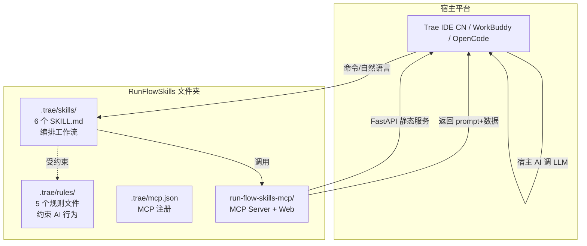
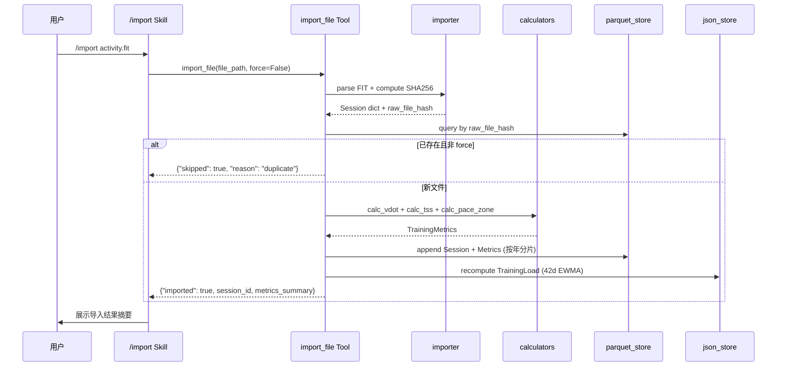
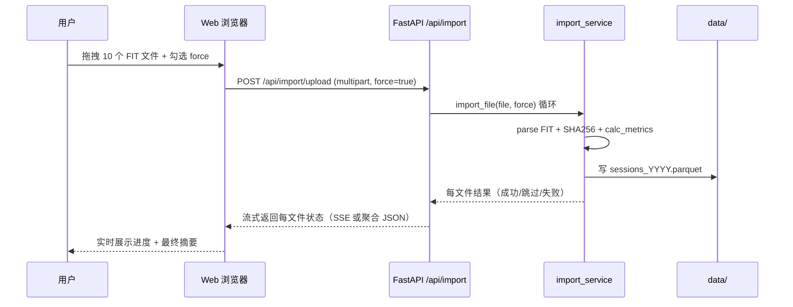
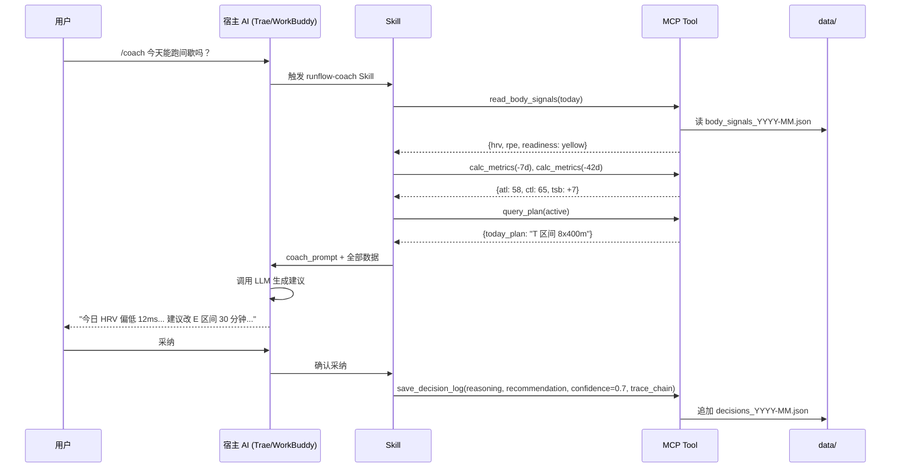

# RunFlowSkills 设计规格说明书

| 项目 | 内容 |
|------|------|
| 项目名称 | RunFlowSkills（深度跑步分析 Skills 套件） |
| 文档版本 | v1.1 |
| 编制日期 | 2026-07-25 |
| 状态 | 评审修正完成（M-1/M-2/M-3 已修正），待制定实现计划 |
| 需求来源 | [RunFlowSkills 用户需求文档](../../reqs/RunFlowSkills用户需求文档.md) |
| 架构参考 | DeepReview（文件夹即产品 + Skill + MCP + Rules + Web 模式） |
| 业务参考 | RunFlowAgent（VDOT/TSS/数字孪生/进化引擎，仅参考算法，不依赖代码） |
| 评审修正 | v1.1：M-1 新增 GPX 格式 / M-2 import_data 拆为 import_file + import_manual（13→14 Tool）/ M-3 新增 Web /settings 页 + UserConfig 模型 |

---

## 目录

- [一、设计决策摘要](#一设计决策摘要)
- [二、总体架构](#二总体架构)
- [三、目录结构](#三目录结构)
- [四、数据模型](#四数据模型)
- [五、存储方案](#五存储方案)
- [六、MCP Tools 清单](#六mcp-tools-清单)
- [七、Skills 工作流](#七skills-工作流)
- [八、Rules 规则文件](#八rules-规则文件)
- [九、Web 可视化](#九web-可视化)
- [十、AI 调用架构](#十ai-调用架构)
- [十一、依赖技术栈](#十一依赖技术栈)
- [十二、测试策略](#十二测试策略)
- [十三、CICD 与分发](#十三cicd-与分发)
- [十四、MVP 范围与验收](#十四mvp-范围与验收)
- [十五、风险与降级](#十五风险与降级)
- [十六、演进路径](#十六演进路径)

---

## 一、设计决策摘要

本文档基于需求文档通过 brainstorming 流程确认的核心决策（v1.0 共 10 项，v1.1 评审修正新增 #11，并对 #5/#6/#7 表述同步更新）：

| # | 决策点 | 选择 | 理由 |
|---|--------|------|------|
| 1 | MVP 范围 | 6 个 Skill（不含 /twin） | /twin 推迟 v0.2.0，MVP 聚焦核心 |
| 2 | 代码复用策略 | 独立重写 | RunFlowAgent 是只读参考项目；与 DeepReview 独立服务层理念一致；零耦合 |
| 3 | AI 调用架构 | Tool 不调 LLM，返回 prompt+数据 | DeepReview 模式；MCP Server 无 LLM SDK 依赖；AI 能力由宿主提供 |
| 4 | 存储位置 | 项目级 data/，文件夹即应用 | 与 DeepReview 一致；除系统环境变量外所有数据不出文件夹 |
| 5 | MCP Tools 颗粒度 | 中粒度 14 个 | 参考 DeepReview 密度（11 个），按数据操作类型分组；import_data 拆为 import_file + import_manual（M-2 评审修正） |
| 6 | Web 可视化 | MVP 含薄层（DeepReview 模式） | 复用 FastAPI+HTMX+Alpine+ECharts；MVP 4 页（仪表盘/活动列表/数据导入/设置） |
| 7 | 导入源 | 全部本地文件源 | FIT/GPX/CSV/TCX/XML + 手动录入，不需 OAuth（GPX 用标准库 xml.etree，无新依赖） |
| 8 | 架构方案 | 方案 B：薄 tools + 厚 calculators + services 编排 | 职责清晰，calculators 纯函数易测试，services 被 tools 和 web 共用 |
| 9 | Web 位置 | W1：MCP 包内 `run_flow_skills_mcp/web/` | 与 DeepReview 1:1；改 React 时新增 webui/ + 改造路由，工作量与其他位置相当 |
| 10 | Web 数据导入 | MVP 含可视化批量导入页 | 用户明确要求；复用 import_service，与 MCP tool 行为一致 |
| 11 | 个人配置入口 | constants.py 默认值 + Web /settings 页覆盖（M-3 评审修正） | 默认值保证开箱即用；Web 设置页读写 data/config.json 让用户覆盖最大心率/乳酸阈值心率/年龄/体重/性别；calc_metrics 读取 config.json 覆盖默认值。无新 MCP Tool（避免 MVP 工具膨胀） |

---

## 二、总体架构

### 2.1 四层架构



### 2.2 层级职责

| 层 | 位置 | 职责 |
|---|------|------|
| 交互层 | 宿主平台 | 用户对话、命令识别、LLM 调用、AI 解读 |
| Skills 编排层 | `.trae/skills/` | 工作流编排、用户确认、AI prompt 调度 |
| MCP Tools 层 | `run-flow-skills-mcp/` | 数据读写、计算、prompt 模板、规则校验、Web API |
| Rules 约束层 | `.trae/rules/` | 计算规则、分析规则、教练规则、数据安全、交互规则 |
| 数据存储层 | `data/` | Parquet（Session/Metrics）+ JSON（Load/BodySignal/DecisionLog/Plan） |

### 2.3 核心设计哲学

1. **Tool 不调 LLM**（DeepReview 模式）：Tool 返回 `prompt + 结构化数据`，由 Skill 让宿主 AI 调 LLM。MCP Server 无 LLM SDK 依赖。
2. **calculators 纯函数**：VDOT/TSS/HRV 计算无 IO，易测试，参考 RunFlowAgent `src/core/calculators/` 模式但独立实现。
3. **文件夹即应用**：所有数据不出 `data/`（除系统环境变量等必须外置）。
4. **services 共用**：tools 和 web 共用 services 编排层，避免业务逻辑重复。

---

## 三、目录结构

```
RunFlowSkills/
├── run-flow-skills-mcp/                       # 纯 MCP Server + Web 服务层
│   ├── src/run_flow_skills_mcp/
│   │   ├── __init__.py
│   │   ├── server.py                          # FastMCP 服务入口（注册 14 个 tool）
│   │   ├── models.py                          # Pydantic 数据模型
│   │   ├── constants.py                       # 默认配置（最大心率/乳酸阈值心率/年龄/体重/性别 + 配速区间/心率区间/EWMA 窗口）— 用户可经 Web /settings 覆盖
│   │   │
│   │   ├── calculators/                       # 纯计算（无 IO，易测试）
│   │   │   ├── __init__.py
│   │   │   ├── vdot.py                        # VDOT (Powers 方法，距离≥1500m)
│   │   │   ├── training_load.py               # TSS/CTL(42d EWMA)/ATL(7d)/TSB
│   │   │   ├── hrv.py                         # RMSSD/SDNN/pNN50 + 基线偏离
│   │   │   ├── fatigue.py                     # 疲劳度综合评估
│   │   │   ├── pace_zones.py                  # E/M/T/I/R 配速区间
│   │   │   └── hr_zones.py                    # 心率区间分布
│   │   │
│   │   ├── storage/                           # 存储引擎（Parquet + JSON）
│   │   │   ├── __init__.py
│   │   │   ├── parquet_store.py               # Session/Metrics 按年分片
│   │   │   ├── json_store.py                  # Load/BodySignal/DecisionLog/Plan JSON 读写
│   │   │   ├── importer.py                    # FIT/GPX/CSV/TCX/XML 解析 + SHA256 去重（GPX 用 xml.etree）
│   │   │   └── dedup.py                       # 跨平台去重（时间±5min+距离±2%）
│   │   │
│   │   ├── services/                          # 业务编排（tools 和 web 共用）
│   │   │   ├── __init__.py
│   │   │   ├── import_service.py              # 导入编排
│   │   │   ├── analysis_service.py            # 分析编排
│   │   │   ├── plan_service.py                # 计划编排
│   │   │   ├── review_service.py              # 复盘编排
│   │   │   ├── coach_service.py               # 教练编排
│   │   │   └── stats_service.py               # 统计导出编排
│   │   │
│   │   ├── prompts/                           # AI Prompt 模板（tool 返回给宿主 AI）
│   │   │   ├── __init__.py
│   │   │   ├── analyze_prompt.py              # 分析解读 prompt
│   │   │   ├── plan_prompt.py                 # 计划生成 prompt
│   │   │   ├── review_prompt.py               # 复盘报告 prompt
│   │   │   ├── coach_prompt.py                # 教练建议 prompt
│   │   │   └── decision_trace.py              # 决策溯源链模板
│   │   │
│   │   ├── tools/                             # MCP Tools（薄编排，14 个）
│   │   │   ├── __init__.py
│   │   │   ├── import_file.py                 # import_file（文件导入：FIT/GPX/CSV/TCX/XML）
│   │   │   ├── import_manual.py               # import_manual（手动录入）
│   │   │   ├── query_sessions.py              # query_sessions
│   │   │   ├── calc_metrics.py                # calc_metrics
│   │   │   ├── get_trends.py                  # get_trends
│   │   │   ├── analyze_fatigue.py             # analyze_fatigue
│   │   │   ├── generate_plan.py               # generate_plan
│   │   │   ├── query_plan.py                  # query_plan
│   │   │   ├── get_period_summary.py          # get_period_summary
│   │   │   ├── read_body_signals.py           # read_body_signals
│   │   │   ├── get_decision_trace.py          # get_decision_trace
│   │   │   ├── save_decision_log.py           # save_decision_log
│   │   │   ├── get_statistics.py              # get_statistics
│   │   │   └── export_data.py                 # export_data
│   │   │
│   │   └── web/                               # Web 可视化（DeepReview 模式）
│   │       ├── __init__.py
│   │       ├── app.py                         # FastAPI 应用工厂 + 入口
│   │       ├── services.py                    # Web 编排层（复用 services/）
│   │       ├── schemas.py                     # Web 请求/响应模型
│   │       ├── routes/                        # 路由模块
│   │       │   ├── __init__.py
│   │       │   ├── dashboard.py               # 仪表盘（MVP）
│   │       │   ├── activities.py              # 活动列表（MVP）
│   │       │   ├── import_page.py             # 数据导入页（MVP）
│   │       │   ├── settings.py                # 设置页（MVP，M-3 评审修正：读写 data/config.json）
│   │       │   ├── trends.py                  # 趋势图表（P1）
│   │       │   └── decisions.py               # AI 决策日志（P1）
│   │       ├── templates/                     # Jinja2 模板
│   │       │   ├── base.html
│   │       │   ├── errors.html
│   │       │   └── partials/
│   │       └── static/                        # 静态资源（HTMX/Alpine/ECharts 本地化）
│   │
│   ├── tests/                                 # 测试套件
│   │   ├── test_calculators_*.py              # 计算器单元测试
│   │   ├── test_storage_*.py                  # 存储层测试
│   │   ├── test_services_*.py                 # 服务编排测试
│   │   ├── test_tools_*.py                    # 14 个 Tools 测试
│   │   ├── test_web_routes.py                 # Web 路由测试
│   │   └── test_e2e_*.py                      # Playwright E2E
│   │
│   ├── data/                                  # 运行时数据（.gitignore）
│   │   ├── sessions/                          # Session Parquet 按年分片
│   │   ├── metrics/                           # Metrics Parquet 按年分片
│   │   ├── load/                              # TrainingLoad JSON
│   │   ├── body_signals/                      # BodySignal JSON 按月
│   │   ├── decisions/                         # DecisionLog JSON 按月
│   │   ├── plans/                             # 训练计划 JSON
│   │   └── config.json                        # 用户配置（最大心率/乳酸阈值心率/年龄/体重/性别，M-3 评审修正）
│   │
│   ├── pyproject.toml                         # Python 项目配置
│   └── uv.lock                                # 依赖锁定
│
├── .trae/                                     # Trae 配置与 Skills/Rules
│   ├── mcp.json                               # 项目级 MCP 配置（${workspaceFolder}）
│   ├── hooks.json                             # Trae 钩子配置
│   ├── skills/                                # 6 个 Skill 源文件
│   │   ├── runflow-import/                    # /import
│   │   ├── runflow-analyze/                   # /analyze
│   │   ├── runflow-plan/                      # /plan
│   │   ├── runflow-review/                    # /review
│   │   ├── runflow-coach/                     # /coach
│   │   └── runflow-stats/                     # /stats
│   └── rules/                                 # 5 个规则文件
│       ├── calculation-rules.md               # 计算规则
│       ├── analysis-rules.md                  # 分析规则
│       ├── coaching-rules.md                  # 教练规则
│       ├── data-safety-rules.md               # 数据安全规则
│       └── interaction-rules.md               # 交互规则
│
├── .github/workflows/                         # CI/CD
│   ├── test.yml                               # 单元 + E2E 测试
│   └── release.yml                            # 打包发布
│
├── scripts/                                   # 开发者工具
│   ├── build-release.ps1                      # Windows 发布包构建
│   └── build-release.sh                       # Linux/macOS 发布包构建
│
├── docs/                                      # 文档
│   ├── reqs/                                  # 已有需求文档
│   └── superpowers/specs/                     # 设计文档（本文件）
│
├── install.ps1                                # Windows 安装脚本
├── install.sh                                 # Linux/macOS 安装脚本
├── QUICKSTART.md                              # 5 分钟快速上手
├── DEPLOY.md                                  # 详细部署指南
├── README.md                                  # 项目说明
└── LICENSE                                    # MIT
```

### 3.1 模块划分理由

| 模块 | 职责 | 依赖 |
|------|------|------|
| `calculators/` | 纯计算（无 IO） | 仅 pyarrow/polars 数据结构 |
| `storage/` | 数据读写 | pyarrow、polars、fitparse |
| `services/` | 业务编排 | calculators + storage |
| `prompts/` | AI Prompt 模板 | 无（纯字符串模板） |
| `tools/` | MCP Tools 薄包装 | services + prompts |
| `web/` | Web 可视化 | services |

**关键约束**：
- `calculators/` 禁止 import `storage/` 或 `services/`（保持纯函数）
- `tools/` 和 `web/` 通过 `services/` 间接复用业务逻辑，不直接调用 `calculators/`
- `prompts/` 不依赖任何模块，仅返回字符串

---

## 四、数据模型

所有 Pydantic 模型在 `models.py` 统一定义。

### 4.1 Session（单次跑步记录）

```python
class Session(BaseModel):
    """单次跑步记录（核心实体，Parquet 按年分片）"""
    session_id: str                    # 格式：sess_YYYYMMDD_NNN
    activity_date: datetime            # 活动日期（UTC）
    distance_m: float                  # 距离（米），>0
    duration_s: int                    # 时长（秒），>0
    avg_pace_s_per_km: float           # 平均配速（秒/km）= duration_s / (distance_m/1000)
    avg_hr: Optional[int] = None       # 平均心率（bpm）
    max_hr: Optional[int] = None       # 最大心率（bpm）
    hr_zones: Optional[dict] = None    # 心率区间分布 {Z1: 0.1, Z2: 0.4, ...}
    cadence: Optional[int] = None      # 平均步频（spm）
    elevation_gain_m: Optional[float] = None  # 累计爬升（米）
    source: Literal["garmin", "coros", "apple", "suunto", "polar", "manual"]
    raw_file_hash: Optional[str] = None       # 原始文件 SHA256（去重键）
    raw_file_path: Optional[str] = None       # 原始文件名（追溯）
    notes: Optional[str] = None       # 用户备注
```

### 4.2 TrainingMetrics（训练指标）

```python
class TrainingMetrics(BaseModel):
    """训练指标（由 Session 计算，Parquet 按年分片，与 Session 同 session_id）"""
    session_id: str
    vdot: Optional[float] = None              # VDOT（距离≥1500m 时计算，否则 None）
    vdot_confidence: Literal["high", "estimated", "low"]  # 距离<1500m 标 "estimated"
    tss: float                                # 训练压力分数 = duration_s × IF² × 100
    intensity_factor: float                   # IF = 强度因子
    efficiency_factor: Optional[float] = None # EF = 配速/心率
    pace_zone: Literal["E", "M", "T", "I", "R"]  # 主导配速区间
```

### 4.3 TrainingLoad（训练负荷，日聚合）

```python
class TrainingLoad(BaseModel):
    """训练负荷（日聚合，JSON 单文件追加）"""
    date: str                                # YYYY-MM-DD
    ctl: float                               # 慢性负荷（42 天 EWMA）
    atl: float                               # 急性负荷（7 天 EWMA）
    tsb: float                               # 训练压力平衡 = CTL - ATL
    weekly_tss: float                        # 当周累计 TSS
    updated_at: datetime
```

### 4.4 BodySignal（身体信号，日粒度）

```python
class BodySignal(BaseModel):
    """身体信号（日粒度，JSON 按月分文件）"""
    date: str                                # YYYY-MM-DD
    hrv_rmssd: Optional[float] = None        # HRV (RMSSD, ms)
    hrv_sdnn: Optional[float] = None         # HRV (SDNN, ms)
    hrv_pnn50: Optional[float] = None        # HRV (pNN50, %)
    resting_hr: Optional[int] = None         # 静息心率（bpm）
    sleep_quality: Optional[int] = None      # 睡眠质量 1-5
    rpe: Optional[int] = None                # 主观疲劳度 1-10
    hrv_baseline: Optional[float] = None     # 个人 HRV 基线（7/30 天均值）
    hrv_deviation_pct: Optional[float] = None  # 偏离基线百分比
```

### 4.5 DecisionLog（AI 决策记录，transparency 核心）

```python
class DecisionLog(BaseModel):
    """AI 决策记录（transparency 核心，JSON 按月分文件）"""
    decision_id: str                         # 格式：dec_YYYYMMDD_NNN
    timestamp: datetime
    decision_type: Literal["coach", "plan_adjust", "review", "analysis"]
    inputs: dict                             # 决策输入数据快照
    reasoning: str                           # 判断逻辑（AI 填充）
    recommendation: str                      # 建议（AI 填充）
    confidence: float                        # 置信度 0-1
    trace_chain: list[str]                   # 溯源链（数据依据 → 规则 → 结论）
    related_session_ids: list[str] = []      # 关联 Session
    user_feedback: Optional[Literal["adopted", "rejected", "modified"]] = None
```

### 4.6 TrainingPlan（训练计划）

```python
class TrainingPlan(BaseModel):
    """训练计划（JSON 单文件/计划）"""
    plan_id: str                             # 格式：plan_YYYYMMDD_NNN
    goal_type: Literal["full_marathon", "half_marathon", "10k", "5k"]
    goal_time: str                           # 目标时间 HH:MM:SS
    race_date: str                           # YYYY-MM-DD
    weeks: int                               # 计划周数
    current_vdot: float                      # 起始 VDOT
    target_vdot: float                       # 目标 VDOT
    phases: list[PlanPhase]                  # 周期化阶段（基础/进展/巅峰/减量）
    created_at: datetime
    status: Literal["draft", "active", "completed", "abandoned"]

class PlanPhase(BaseModel):
    """计划阶段"""
    phase_type: Literal["base", "build", "peak", "taper"]
    weeks: list[PlanWeek]

class PlanWeek(BaseModel):
    """计划周"""
    week_index: int
    sessions: list[PlanSession]

class PlanSession(BaseModel):
    """计划内单次训练"""
    day: int                                 # 0=周一
    pace_zone: Literal["E", "M", "T", "I", "R", "rest"]
    duration_s: int
    distance_m: Optional[float] = None
    pace_range_s_per_km: tuple[float, float]  # 配速区间 [min, max]
    hr_range: Optional[tuple[int, int]] = None
    notes: Optional[str] = None
```

### 4.7 UserConfig（用户配置，M-3 评审修正）

```python
class UserConfig(BaseModel):
    """用户个人配置（JSON 单文件 data/config.json，覆盖 constants.py 默认值）"""
    max_hr: Optional[int] = None              # 最大心率（bpm），None 时用 constants.DEFAULT_MAX_HR
    lthr: Optional[int] = None                # 乳酸阈值心率（bpm），None 时用 constants.DEFAULT_LTHR
    resting_hr: Optional[int] = None          # 静息心率（bpm）
    age: Optional[int] = None                 # 年龄
    weight_kg: Optional[float] = None         # 体重（kg）
    gender: Optional[Literal["male", "female"]] = None
    height_cm: Optional[float] = None         # 身高（cm），用于 BMI 计算
    updated_at: Optional[datetime] = None
```

**读取规则**：`calc_metrics` / `hr_zones` / `pace_zones` 等需要个人参数的计算器，先读 `data/config.json`，字段为 None 时回退到 `constants.py` 默认值。默认值在 constants.py 中明确标注 `# DEFAULT — 用户可经 Web /settings 覆盖`。

### 4.8 ID 生成规则

| 实体 | 格式 | 示例 |
|------|------|------|
| Session | `sess_YYYYMMDD_NNN` | sess_20260725_001 |
| DecisionLog | `dec_YYYYMMDD_NNN` | dec_20260725_001 |
| TrainingPlan | `plan_YYYYMMDD_NNN` | plan_20260725_001 |

NNN 为当天序号，从 001 开始，查当天已有最大值 +1。

---

## 五、存储方案

严格遵循"文件夹即应用"，所有数据在 `run-flow-skills-mcp/data/` 下。

### 5.1 存储分工

| 数据类型 | 路径 | 格式 | 分片策略 | 读写模式 |
|---------|------|------|---------|---------|
| Session 原始 | `data/sessions/sessions_YYYY.parquet` | Parquet | 按年分片 | 追加 + 按需查询 |
| TrainingMetrics | `data/metrics/metrics_YYYY.parquet` | Parquet | 按年分片（与 Session 同 key） | 追加 |
| TrainingLoad | `data/load/training_load.json` | JSON | 单文件 | 全量重写（小数据） |
| BodySignal | `data/body_signals/body_signals_YYYY-MM.json` | JSON | 按月分文件 | 部分更新 |
| DecisionLog | `data/decisions/decisions_YYYY-MM.json` | JSON | 按月分文件 | 追加 |
| TrainingPlan | `data/plans/plan_YYYYMMDD_NNN.json` | JSON | 单文件/计划 | 全量读写 |
| 用户配置 | `data/config.json` | JSON | 单文件 | 全量读写（Web /settings 页 + /api/config） |

### 5.2 Parquet vs JSON 分工原则

- **Parquet 用于 Session/Metrics**：列式存储对大批量查询（年度趋势、聚合统计）有 10-100x 性能优势
- **JSON 用于其他**：BodySignal/DecisionLog 是小数据 + 频繁追加，JSON 更直观易调试，符合 ponytail "YAGNI"
- **Parquet Schema**：用 PyArrow 显式定义 schema，避免类型推断错误。Session 和 Metrics 按 `session_id` 关联，不存外键关系，查询时 Polars join

### 5.3 数据去重策略

**主去重键**：`raw_file_hash`（SHA256）
- FIT/GPX/CSV/TCX/XML 文件计算 SHA256，与已存 Session 比对
- 冲突时默认跳过，`--force` 覆盖

**跨平台去重**（Garmin 和 Apple Watch 同一活动）：
- 时间戳匹配：`abs(t1 - t2) <= 5 分钟`
- 距离匹配：`abs(d1 - d2) / max(d1, d2) <= 2%`
- 时长匹配：`abs(dur1 - dur2) <= 30 秒`
- 三条同时满足视为同一活动，保留先导入的，跳过后导入的

**手动录入去重**：
- 同一天 + 距离 ±2% + 时长 ±5% 提示用户确认是否重复

### 5.4 数据流（导入示例）



---

## 六、MCP Tools 清单

14 个 tool，每个是 `services/` 的薄包装：参数校验 → 调 service → 返回结构化结果。**不调 LLM**，AI 解读由 Skill 编排宿主完成。

### 6.1 Tools 规格表

| # | Tool | 入参 | 出参 | 关联 Skill |
|---|------|------|------|-----------|
| 1 | `import_file` | `file_path: str, force: bool=False` | `{imported, session_id, metrics_summary, skipped?, reason?}` | /import |
| 2 | `import_manual` | `manual_data: dict, force: bool=False`（manual_data 含 activity_date/distance_m/duration_s/avg_hr?/source 等） | `{imported, session_id, metrics_summary, skipped?, reason?}` | /import |
| 3 | `query_sessions` | `filters: {date_from?, date_to?, source?, limit?}` | `{sessions: list[Session+Metrics]}` | /import /analyze /review |
| 4 | `calc_metrics` | `date_from: str, date_to: str` | `{vdot_trend, tss_sum, ctl, atl, tsb, hr_zones_dist}` | /analyze |
| 5 | `get_trends` | `days: int=30, metric: str="vdot"\|"load"\|"hrv"` | `{series: [{date, value}], change_pct, baseline}` | /analyze |
| 6 | `analyze_fatigue` | `days: int=7` | `{fatigue_score, risk_level, main_factors, hrv_deviation, tsb}` | /analyze /coach |
| 7 | `generate_plan` | `goal_type, goal_time, race_date, weeks, current_vdot` | `{plan_id, phases, pace_zones, plan_prompt}` ⚠ 含 prompt | /plan |
| 8 | `query_plan` | `plan_id?` | `{plan: TrainingPlan, fidelity?: {planned_vs_actual}}` | /plan /review |
| 9 | `get_period_summary` | `period: str="week"\|"month"\|"season"\|"year", date_ref?` | `{total_distance, total_tss, avg_vdot, load_change, sessions_count}` | /review |
| 10 | `read_body_signals` | `date?` | `{hrv, resting_hr, sleep, rpe, baseline, deviation_pct, readiness_level}` | /coach |
| 11 | `get_decision_trace` | `decision_id` | `{inputs, reasoning, recommendation, confidence, trace_chain}` | /coach |
| 12 | `save_decision_log` | `decision_type, inputs, reasoning, recommendation, confidence, trace_chain` | `{decision_id, saved: true}` | /coach /plan /review |
| 13 | `get_statistics` | `dimension: str, date_from?, date_to?` | `{groups: [{key, count, total_distance, avg_pace, ...}]}` | /stats |
| 14 | `export_data` | `format: "csv"\|"json"\|"parquet"\|"md", filters?, include_ai_logs: bool=False` | `{file_path, rows_count, format}` | /stats /review |

### 6.2 关键约定

- `generate_plan` 返回 `plan_prompt`：plan_service 生成结构化计划后，附带"请用此 prompt 向用户解释计划理由"的 prompt 模板，宿主 AI 用它生成自然语言解释
- `read_body_signals` 返回 `readiness_level`：tool 内部综合 HRV 偏离 + TSB（来自 TrainingLoad）+ RPE 按规则计算就绪状态（green/yellow/red），符合 coaching-rules.md "就绪状态评估必须综合 HRV + TSB + RPE"。AI 仅做自然语言解读
- `save_decision_log` 的 `reasoning/recommendation/trace_chain` 由宿主 AI 生成后传入持久化

### 6.3 Skill 与 Tool 调用矩阵

| Skill \ Tool | import_file | import_manual | query_sessions | calc_metrics | get_trends | analyze_fatigue | generate_plan | query_plan | get_period_summary | read_body_signals | get_decision_trace | save_decision_log | get_statistics | export_data |
|---|:-:|:-:|:-:|:-:|:-:|:-:|:-:|:-:|:-:|:-:|:-:|:-:|:-:|:-:|
| /import | ✅ | ✅ | ✅ | | | | | | | | | | | |
| /analyze | | | ✅ | ✅ | ✅ | ✅ | | | | | | ✅ | | |
| /plan | | | ✅ | | | | ✅ | ✅ | | | | ✅ | | |
| /review | | | ✅ | ✅ | | | | ✅ | ✅ | | | ✅ | | ✅ |
| /coach | | | | ✅ | | ✅ | | ✅ | | ✅ | ✅ | ✅ | | |
| /stats | | | ✅ | | | | | | | | | | ✅ | ✅ |

**关键复用**：`query_sessions` 被 4 个 Skill 共用，`save_decision_log` 被 4 个 Skill 共用——证明 services 层抽象合理。

---

## 七、Skills 工作流

每个 Skill 在 `.trae/skills/runflow-<name>/SKILL.md`，frontmatter `name + description`，主体含：When to Use / Workflow / Quick Reference / Common Mistakes / 约束规则。

### 7.1 `/import` Skill（runflow-import）

**触发**：导入/上传/同步/录入

**工作流**：
1. 确定数据源（FIT/GPX/CSV/TCX/XML 文件路径 / Garmin 导出目录 / Apple Health XML / 手动录入）
2. 调用对应 Tool：文件源调用 `import_file(file_path, force)`，手动录入调用 `import_manual(manual_data, force)`
3. 处理去重结果（skipped=true 询问是否 --force；imported=true 展示 metrics_summary）
4. 批量导入循环调用，最后汇总 {成功N, 跳过M, 失败K}

**常见错误**：重复导入不提示 --force；手动录入未校验距离/时长合理性

**约束**：SHA256 去重；跨平台去重（时间±5min+距离±2%+时长±30s）；导入失败必须给明确原因

### 7.2 `/analyze` Skill（runflow-analyze）

**触发**：分析/负荷/VDOT/HRV/疲劳/心率漂移

**工作流**：
1. 确定分析范围（默认 30 天，支持 7/30/90/365 天或自定义）
2. 并行调用 `calc_metrics` + `get_trends` + `analyze_fatigue`
3. AI 解读（用 analyze_prompt 调宿主 LLM）：必须具体到数据、附数据依据、列风险因子、标注误差范围
4. 可选：`save_decision_log` 持久化分析结论

**常见错误**：笼统结论（"训练不错"）；静默外推；伪精确

### 7.3 `/plan` Skill（runflow-plan）

**触发**：计划/课表/目标/全马/破4

**工作流**：
1. 收集目标（goal_type, goal_time, race_date, weeks）
2. 评估当前能力（`query_sessions` 取 90 天数据 → 当前 VDOT）
3. 生成计划（`generate_plan` → 结构化计划 + plan_prompt；用 plan_prompt 调宿主 LLM 生成解释）
4. **用户确认（强制）**：展示完整计划 + AI 解释，必须确认后才保存
5. `save_decision_log` 记录计划生成决策
6. 漏练自适应：后续 `query_plan` 自动计算 fidelity，漏练检测 → 重新分配后续负荷（负荷守恒，不追加）

**常见错误**：未经确认直接保存；漏练后追加负荷；配速区间未基于个人 VDOT

### 7.4 `/review` Skill（runflow-review）

**触发**：复盘/总结/本周/本月/回顾

**工作流**：
1. 确定周期（默认本周，支持 week/month/season/year）
2. 聚合周期数据（`get_period_summary`）
3. 对比上周期（环比 vs 上周期，同比 vs 去年同期）
4. AI 生成报告（用 review_prompt 调宿主 LLM）：跑量统计/负荷变化/VDOT 趋势/HRV 趋势/伤病风险/下周建议
5. 可选：`export_data(format="md")` 导出 Markdown 报告
6. `save_decision_log` 记录复盘结论

**常见错误**：复盘笼统；缺数据维度静默跳过（必须明确标注）

### 7.5 `/coach` Skill（runflow-coach，差异化核心）

**触发**：能不能跑/今天怎么练/感觉累/恢复

**工作流**：
1. 读取身体信号（`read_body_signals(today)` → HRV/静息心率/睡眠/RPE/基线偏离/就绪状态 green/yellow/red）
   - 注：readiness_level 由 tool 内部综合 HRV + TSB + RPE 计算（读 BodySignal + TrainingLoad）
2. 读取训练负荷（调用 `calc_metrics` tool：传 `date_from=-7d` 取 ATL，传 `date_from=-42d` 取 CTL/TSB）
3. 读取当前计划（`query_plan(active)` → 今日计划课表）
4. AI 综合判断（用 coach_prompt 调宿主 LLM）：类型+强度+时长+配速区间（具体可执行）+溯源链+置信度+替代方案
5. **置信度门禁**：confidence ≥ 0.6 直接给建议；< 0.6 提示"仅供参考，建议结合主观感受"
6. 用户反馈：询问是否采纳 → `save_decision_log` 记录 user_feedback
7. 历史查询（可选）：用户问"上次类似情况" → `get_decision_trace`

**常见错误**：建议不具体；单一指标决策；建议与计划冲突；confidence < 0.6 未提示

### 7.6 `/stats` Skill（runflow-stats）

**触发**：统计/分布/导出/趋势

**工作流**：
1. 确定统计维度（by_week/by_month/by_year/by_pace_zone/by_hr_zone/by_distance_range/by_source）
2. 调用 `get_statistics` 返回分组聚合数据
3. 展示统计（表格 + 简要文字，不调 LLM）
4. 可选导出：`export_data(format, include_ai_logs)`；**导出前必须用户确认**

**常见错误**：导出前未确认；全量导出未包含 AI 分析记录

### 7.7 命令清单与自然语言触发

| 命令 | 必填参数 | 可选参数 | 自然语言关键词 |
|------|---------|---------|--------------|
| `/import` | 文件路径 or 手动数据 | `--force` | 导入/上传/同步/录入 |
| `/analyze` | 无 | `--days 7/30/90/365` `--metric vdot/load/hrv` | 分析/负荷/VDOT/HRV/疲劳 |
| `/plan` | `--goal` | `--race-date` `--weeks` | 计划/课表/目标/全马/破4 |
| `/review` | 无 | `--period week/month/season/year` | 复盘/总结/本周/本月 |
| `/coach` | 无（自然语言） | — | 能不能跑/今天怎么练/感觉累/恢复 |
| `/stats` | 无 | `--dimension` `--format csv/json/parquet/md` | 统计/分布/导出/趋势 |

---

## 八、Rules 规则文件

位于 `.trae/rules/`，被 Skills 引用约束 AI 行为。规则文件是 Markdown，Trae 自动加载为 system rules。

### 8.1 `calculation-rules.md`（计算规则）

1. VDOT 计算必须使用 Powers 方法，距离 <1500m 时标记为 "estimated" 并降低置信度
2. TSS = 时长(秒) × IF² × 100，IF 基于乳酸阈值心率或配速
3. CTL = 42 天 EWMA，ATL = 7 天 EWMA，TSB = CTL - ATL
4. 配速格式统一 M'SS"/km（如 5'40"/km），时长统一 HH:MM:SS
5. 心率区间基于个人最大心率或乳酸阈值心率，不可使用通用公式默认值（如 220-年龄）。默认值见 constants.py（DEFAULT_MAX_HR / DEFAULT_LTHR），用户可经 Web `/settings` 页覆盖 `data/config.json`；计算器读取顺序：config.json → constants.py 默认值
6. 配速区间基于个人 VDOT：E=59-74%, M=75-84%, T=88-100%, I=95-100%, R=100-110%
7. EWMA 计算：当日值 × α + 昨日 EWMA × (1-α)，α = 2/(N+1)，N 为窗口天数
8. HRV 指标：RMSSD（主）、SDNN、pNN50，基线 = 7 天滚动均值

### 8.2 `analysis-rules.md`（分析规则）

1. AI 分析必须具体到数据层面，禁止笼统结论（"训练不错"/"负荷合理" 不合规）
2. 趋势判断必须附数据依据（"CTL 65 较上周 +3" 而非 "负荷上升"）
3. 伤病风险评估必须列出主要风险因子，不可只给 "有风险"
4. 预测结果必须标注误差范围，禁止伪精确（"全马 3:59:30" 不合规，必须 "3:55:00–4:05:00"）
5. 数据不足时必须明确降级标注（"基于 7 天数据，置信度低"），不可静默外推
6. 同比/环比对比必须明确时间窗口（"vs 上周" / "vs 去年同期"）
7. 心率漂移分析必须基于相同配速段，不可跨配速段混合计算

### 8.3 `coaching-rules.md`（教练规则，差异化核心）

1. AI 建议必须具体可执行：类型 + 强度 + 时长 + 配速区间（"E 区间 30 分钟，配速 5'40"-6'00"/km"）
2. 建议必须附决策溯源链：输入数据 + 判断规则 + 置信度 + 替代方案
3. 就绪状态评估必须综合 HRV + TSB + RPE，单一指标不可单独决策
4. 建议不得与当前训练计划冲突（计划是休息日不可建议高强度；冲突时给"调整建议"并说明）
5. confidence < 0.6 时必须提示 "仅供参考，建议结合主观感受"
6. 建议必须考虑 24h 内的高强度训练历史（昨跑 T5 间歇 → 今日降级）
7. 用户反馈（采纳/拒绝/修改）必须记录到 DecisionLog
8. 替代方案至少 1 个（如"今日推荐 E 区间，替代方案：完全休息或 M 区间 20 分钟"）

### 8.4 `data-safety-rules.md`（数据安全规则）

1. 所有数据仅存储在本地 data/ 目录，禁止上传任何外部服务
2. 导出数据前需用户确认
3. 不记录用户姓名、身份证号、手机号等个人身份信息（PII）；年龄/体重/性别/身高/心率等训练参数不属 PII，存于 `data/config.json` 用于计算
4. FIT/GPX/CSV/TCX/XML 文件解析在本地完成，不调用外部 API
5. Web 可视化仅绑定 127.0.0.1，JS 库本地化（HTMX/Alpine/ECharts 无 CDN）
6. 原始文件 SHA256 哈希存储用于去重，原始文件路径可选保留
7. 导出含 AI 决策日志时二次确认（含敏感训练分析）
8. 不记录 IP 地址、设备指纹等环境信息

### 8.5 `interaction-rules.md`（交互规则）

1. 命令格式：/import /analyze /plan /review /coach /stats
2. 自然语言关键词：导入/分析/计划/复盘/教练/统计
3. 每次操作结果必须给出明确反馈（成功/跳过/失败 + 原因）
4. 错误发生时提供降级方案而非直接报错：
   - FIT 解析失败 → 提示手动录入
   - 数据不足 → 降级为趋势外推并标注
   - AI 解读异常 → 提示重试 + 提供原始数据
5. 以下场景必须用户确认：
   - 训练计划生成后保存前
   - 数据导入去重检测到冲突时
   - AI 教练建议给出后是否采纳
   - 数据导出前
6. 命令未识别时提示可用命令清单
7. 批量操作（如导入 100 文件）展示进度

---

## 九、Web 可视化

### 9.1 技术栈

| 组件 | 技术 | 版本 | 说明 |
|------|------|------|------|
| 后端 | FastAPI | 0.115+ | 复用 services/ 编排 |
| 模板 | Jinja2 | 3.1+ | 服务端渲染 |
| 局部刷新 | HTMX | 1.9+ | OOB swap |
| 轻交互 | Alpine.js | 3.x | 表单状态 |
| 图表 | ECharts | 5.x | 趋势/分布图 |
| 静态服务 | FastAPI StaticFiles | - | JS 库本地化 |

**启动方式**：`uv run run-flow-skills-web` → http://127.0.0.1:8002

**端口选择**：8002（DeepReview 用 8001，RunFlowAgent 用 8765/8766，避免冲突）

### 9.2 MVP 页面（4 页）

#### 页面 1：仪表盘 `/`

- 4 个 KPI 卡片：CTL / ATL / TSB / VDOT（带环比箭头）
- 训练负荷趋势图（30 天 CTL/ATL/TSB 折线图，ECharts）
- 本周训练摘要（每日训练列表）

#### 页面 2：活动列表 `/activities`

- 表格：日期 / 距离 / 时长 / 配速 / VDOT / 来源
- 筛选（日期范围 / 来源）+ 搜索
- 点击行展开详情（心率曲线 / 配速曲线 / 区间分布）—— HTMX OOB swap
- 分页

#### 页面 3：数据导入 `/import` ⭐

- 拖拽区域 + 文件选择按钮（支持多选）
- 文件类型白名单：.fit .gpx .csv .tcx .xml
- 强制重新导入勾选框（--force）
- 导入进度列表（逐文件状态：✅ 已导入 / ⏭️ 跳过 / ❌ 失败 / ⏳ 进行中）
- 手动录入表单（备用方案）：日期 / 距离 / 时长 / 心率 / 来源

#### 页面 4：设置 `/settings`（M-3 评审修正）

- 表单字段：最大心率 / 乳酸阈值心率 / 静息心率 / 年龄 / 体重(kg) / 身高(cm) / 性别
- 每个字段显示当前值（来自 data/config.json）+ 占位符提示 constants.py 默认值（如"未设置时默认 190"）
- 保存按钮 → PUT /api/config，写入 data/config.json
- 重置按钮 → 清空 config.json 对应字段，回退到 constants.py 默认值
- 说明文字："这些参数用于心率区间和训练负荷计算，请根据实测值填写（如乳酸阈值心率需实验室测试）"

### 9.3 Web 路由设计（API-first，为改 React 铺路）

| 路由 | 方法 | 返回 | MVP | 说明 |
|------|------|------|:--:|------|
| `/` | GET | HTML（仪表盘） | ✅ | |
| `/activities` | GET | HTML（列表） | ✅ | |
| `/activities/{id}` | GET | HTML 片段（详情） | ✅ | HTMX OOB |
| `/import` | GET | HTML（导入页） | ✅ | |
| `/settings` | GET | HTML（设置页） | ✅ | M-3 评审修正 |
| `/api/sessions` | GET | JSON | ✅ | |
| `/api/metrics` | GET | JSON | ✅ | |
| `/api/load` | GET | JSON | ✅ | |
| `/api/import/upload` | POST | JSON | ✅ | multipart 多文件，调 import_service.import_file（与 import_file tool 共用） |
| `/api/import/manual` | POST | JSON | ✅ | 手动录入，调 import_service.import_manual（与 import_manual tool 共用） |
| `/api/config` | GET | JSON | ✅ | 读取 data/config.json |
| `/api/config` | PUT | JSON | ✅ | 写入 data/config.json（部分字段更新） |
| `/trends` | GET | HTML | P1 | |
| `/api/trends` | GET | JSON | P1 | |
| `/decisions` | GET | HTML | P1 | |
| `/api/decisions` | GET | JSON | P1 | |

**改 React 路径**：保留 `/api/*` 路由，删除 HTML 路由，新增 `webui/` React 项目调用 `/api/*`。

### 9.4 导入流程时序



### 9.5 安全与限制

- ✅ 仅 127.0.0.1，无外部访问
- ✅ 文件类型白名单：`.fit .gpx .csv .tcx .xml`
- ✅ 单文件大小限制：100MB（FIT 文件通常 <10MB）
- ✅ 批量上传上限：100 文件/次
- ✅ 上传完成提示用户校验导入结果（数据安全规则）

### 9.6 实现要点

Web 的 `/api/import/upload` 和 `/api/import/manual` 分别是 `import_service.import_file()` 与 `import_service.import_manual()` 的薄包装，与 MCP `import_file` / `import_manual` tool 共用同一 service。这保证：
- Web 导入与 Skill `/import` 行为完全一致
- 去重、计算、存储逻辑只有一份实现
- 符合方案 B"services 编排层被 tools 和 web 共用"的设计

---

## 十、AI 调用架构

### 10.1 核心流程



### 10.2 关键点

- MCP Tool 不调 LLM，只返回数据 + prompt 模板
- 宿主 AI 用 prompt 调 LLM 生成自然语言
- 决策结果通过 `save_decision_log` 持久化（reasoning/recommendation 由 AI 生成传入）
- prompt 模板在 `prompts/` 模块，tool 返回时附带

---

## 十一、依赖技术栈

### 11.1 pyproject.toml

```toml
[project]
name = "run-flow-skills-mcp"
version = "0.1.0"
description = "深度跑步分析 Skills 套件 - MCP Server + Web"
requires-python = ">=3.12"
dependencies = [
    # MCP 核心
    "fastmcp>=3.0.0",
    "pydantic>=2.0.0",
    # 数据处理
    "pyarrow>=15.0.0",        # Parquet 读写
    "polars>=0.20.0",         # LazyFrame 查询
    "fitparse>=1.2.0",        # FIT 文件解析（GPX/TCX 用标准库 xml.etree，无需新依赖）
    # Web 可视化（薄编排层）
    "fastapi>=0.115",
    "uvicorn>=0.30",
    "jinja2>=3.1",
    "python-multipart>=0.0.9",  # 文件上传
]

[project.optional-dependencies]
# ML 预测（v0.2.0+，MVP 不必需）
ml = [
    "scikit-learn>=1.5.0",
    "scipy>=1.10.0",
    "joblib>=1.3.0",
]
dev = [
    "pytest>=8.0.0",
    "pytest-asyncio>=0.23.0",
    "pytest-cov>=4.0.0",
    "httpx>=0.27",            # FastAPI 测试客户端
    "playwright>=1.40",       # E2E 测试
    "ruff>=0.5.0",
    "mypy>=1.10",
]

[project.scripts]
run-flow-skills-mcp = "run_flow_skills_mcp.server:main"
run-flow-skills-web = "run_flow_skills_mcp.web.app:main"

[build-system]
requires = ["hatchling"]
build-backend = "hatchling.build"

[tool.pytest.ini_options]
markers = [
    "e2e: Playwright E2E tests, run with `uv run pytest -m e2e`",
]
asyncio_mode = "auto"

[tool.ruff]
line-length = 100
target-version = "py312"

[tool.mypy]
python_version = "3.12"
ignore_missing_imports = true
```

### 11.2 版本选择理由

- **Python 3.12+**：与 DeepReview 一致，避免 3.13 兼容性问题（paddleocr 等教训）
- **polars 0.20+**：LazyFrame 优先，符合 RunFlowAgent "禁止 collect() 过早" 规则
- **无 LLM SDK**：MCP Server 不调 LLM，由宿主 AI 调用
- **ML 可选依赖**：MVP 不装，v0.2.0 推演/预测时 `uv sync --extra ml`

### 11.3 .trae/mcp.json

```json
{
  "mcpServers": {
    "run-flow-skills-mcp": {
      "command": "uv",
      "args": [
        "run",
        "--directory",
        "${workspaceFolder}/run-flow-skills-mcp",
        "run-flow-skills-mcp"
      ]
    }
  }
}
```

---

## 十二、测试策略

参照 DeepReview 模式 + RunFlowAgent 测试规范。

### 12.1 测试金字塔

| 测试层 | 范围 | 工具 | 覆盖率门槛 | 用例数预估 |
|--------|------|------|-----------|----------|
| 单元测试 | calculators/（纯函数） | pytest | ≥90% | ~30 |
| 单元测试 | storage/、models/ | pytest | ≥80% | ~15 |
| 单元测试 | tools/（14 个 tool） | pytest | ≥80% | ~20 |
| 集成测试 | services/（编排） | pytest | ≥70% | ~12 |
| 集成测试 | web/routes/ | httpx | ≥70% | ~10 |
| E2E 测试 | 核心 Skill 工作流 | Playwright | - | ~6 |

### 12.2 测试要点

- **calculators 单元测试是核心**：纯函数无 IO，每个公式至少 3 个用例（正常/边界/异常），如 VDOT 计算测试距离 1499m/1500m/42195m
- **tools 测试用 mock services**：验证参数校验 + 调用契约
- **E2E 覆盖核心场景**：导入→分析→计划→复盘→教练→导出 6 条核心链路

### 12.3 测试数据

- `tests/data/fixtures/` 放 FIT 测试文件（独立创建，不依赖 RunFlowAgent）
- 不含真实用户数据，合成 FIT 文件

### 12.4 测试命令

```bash
# 仅单元/集成测试（默认不装 Playwright 浏览器，最快）
uv sync --extra dev
uv run pytest tests/ -m "not e2e"

# E2E 测试（需先装 Playwright 浏览器）
uv run playwright install chromium
uv run pytest tests/ -m e2e

# 覆盖率报告
uv run pytest --cov=src --cov-report=term-missing
```

---

## 十三、CICD 与分发

### 13.1 GitHub Actions

**`.github/workflows/test.yml`**：
- 触发：PR / push to main
- 矩阵：Python 3.12 / 3.13
- 步骤：`uv sync --extra dev` → `ruff check` → `mypy` → `pytest -m "not e2e"` → `pytest -m e2e`（独立 job，需 Playwright 浏览器）
- 覆盖率上传 codecov

**`.github/workflows/release.yml`**：
- 触发：push tag `v*.*.*`
- 步骤：
  1. 跑测试
  2. `scripts/build-release.ps1` / `.sh` 构建三种压缩包
  3. 上传 GitHub Release（`generate_release_notes` 自动 changelog）

### 13.2 分发格式

| 格式 | 适用 | 特点 |
|------|------|------|
| `RunFlowSkills-vX.Y.Z.zip` | Windows | PowerShell `Compress-Archive` 兼容 |
| `RunFlowSkills-vX.Y.Z.tar.zst` | 现代 Linux/macOS | 体积最小（**推荐**） |
| `RunFlowSkills-vX.Y.Z.tar.gz` | 所有 Unix | 兼容性 fallback |

### 13.3 安装脚本（install.ps1 / install.sh）

1. 检查 Python 3.12+
2. 检查/安装 uv
3. `cd run-flow-skills-mcp && uv sync`
4. 提示在 Trae 中打开项目目录 + 启用项目级 MCP
5. 不强制装 ML（v0.2.0+ 才需要）

---

## 十四、MVP 范围与验收

### 14.1 MVP v0.1.0 范围

| 包含 | 不包含 |
|------|--------|
| ✅ 6 个 Skill：/import /analyze /plan /review /coach /stats | ❌ /twin 数字孪生（P1，v0.2.0） |
| ✅ 14 个 MCP Tools（含 import_file / import_manual 拆分） | ❌ ML 预测（P1，v0.2.0） |
| ✅ 5 个 Rules 规则文件 | ❌ 自适应进化引擎（P1，v0.2.0） |
| ✅ FIT/GPX/CSV/TCX/XML 导入 + 手动录入 | ❌ Garmin/Apple Health API 直连（需 OAuth，P2） |
| ✅ Parquet（Session/Metrics）+ JSON（其他）存储 | ❌ 订阅付费层（P2） |
| ✅ Web 可视化 4 页（仪表盘/活动列表/数据导入/设置） | ❌ Web 趋势/决策日志页（P1，v0.2.0） |
| ✅ 用户配置 Web /settings 页（覆盖 constants.py 默认值） | |
| ✅ AI 决策溯源链 + DecisionLog | ❌ B2B 教练管理（P2） |
| ✅ 跨平台去重（SHA256 + 时间/距离匹配） | |
| ✅ 训练计划漏练自适应 | |
| ✅ install.ps1/sh + GitHub Actions | |
| ✅ 解压即用三种格式 | |

### 14.2 验收标准（12 项）

| # | 验收项 | 验证方式 | MVP |
|---|--------|---------|:--:|
| AC-01 | 解压后在 Trae 中打开，**6 个命令**均可触发对应 Skill | 手动验证 | ✅ |
| AC-02 | 导入 10 个 FIT 文件，SHA256 去重生效，重复导入被跳过 | 单元测试 + 手动 | ✅ |
| AC-03 | `/analyze` 输出 VDOT/TSS/CTL/ATL/TSB，格式符合业务规则 | 单元测试 | ✅ |
| AC-04 | `/plan` 生成 12 周全马计划，含 E/M/T/I/R 配速区间 | 集成测试 | ✅ |
| AC-05 | `/coach` 建议附决策溯源链（数据依据 + 判断逻辑 + 置信度） | E2E 测试 | ✅ |
| AC-06 | 所有 AI 输出禁止笼统结论（规则校验） | 单元测试 | ✅ |
| AC-07 | 数据 100% 本地存储，无任何外部请求（除 LLM API 由宿主发起） | 安全测试 | ✅ |
| AC-08 | 全量数据可导出为 CSV/JSON/Parquet/MD | 集成测试 | ✅ |
| AC-09 | 单元测试覆盖率 ≥80% | pytest-cov | ✅ |
| AC-10 | install.ps1 在干净 Windows 环境一键安装成功 | 手动验证 | ✅ |
| AC-11 | Web 数据导入页支持拖拽多文件批量上传（.fit/.gpx/.csv/.tcx/.xml），逐文件反馈状态 | E2E 测试 | ✅ |
| AC-12 | Web `/settings` 页可读写 data/config.json，calc_metrics 读取覆盖后的最大心率生效（M-3 评审修正） | 集成测试 | ✅ |

### 14.3 性能指标

| 指标 | 要求 | 验证 |
|------|------|------|
| 单次 FIT 导入 | <3 秒 | 集成测试 |
| 批量导入 100 文件 | <60 秒 | 集成测试 |
| 训练分析查询（1 年） | <2 秒 | 性能测试 |
| AI 教练咨询响应 | <5 秒（含 LLM） | E2E |
| Web 页面加载 | <1 秒 | E2E |

---

## 十五、风险与降级

| 风险 | 降级方案 |
|------|---------|
| FIT 解析失败（文件损坏） | 提示手动录入（interaction-rules.md） |
| 数据不足（<7 天）做分析 | 标注"数据不足，结论仅供参考"，不静默外推 |
| LLM 调用失败（宿主侧） | Tool 返回原始数据 + prompt，用户自行解读 |
| HRV 数据缺失 | 跳过 HRV 维度，标注"无 HRV 数据" |
| Parquet 写入失败（磁盘满） | 返回明确错误 + 提示清理 data/ |
| Web 文件超 100MB | 拒绝上传 + 提示拆分 |

---

## 十六、演进路径

- **v0.2.0**：/twin 数字孪生 + ML 预测 + 自适应进化引擎 + Web 趋势/决策日志页
- **v0.3.0**：Web 改 React（可选） + 多硬件 API 直连（Garmin/COROS/Apple Health OAuth）
- **v0.4.0+**：订阅付费层 + B2B 教练 SaaS

### 16.1 改 React 路径（v0.3.0 可选）

1. 新增 `webui/` React 项目（Vite+TS+Recharts）
2. 改造 `web/routes/` 为纯 REST API（返回 JSON，删 Jinja2 模板）
3. FastAPI 静态服务 `webui/dist/`
4. 删除 `web/templates/` + `web/static/`（HTMX 资源）
5. 保留所有 `/api/*` 路由（已 API-first 设计）
6. 工作量：约 2-3 天

---

## 附录：与 DeepReview / RunFlowAgent 的模式映射

| 维度 | DeepReview | RunFlowAgent | RunFlowSkills |
|------|------------|--------------|---------------|
| 架构模式 | 文件夹即产品 + Skill + MCP + Rules + Web | CLI + WebUI 重应用 | 文件夹即产品 + Skill + MCP + Rules + Web（**继承 DeepReview**） |
| 业务领域 | K12 错题 | 跑步数据分析 | 跑步数据分析（**继承 RunFlowAgent 算法**） |
| MCP Server 包名 | `deep-review-mcp` | N/A（nanobot-ai 底座） | `run-flow-skills-mcp` |
| Skills 数量 | 5 | N/A | 6（MVP） |
| Rules 数量 | 4 | 6 | 5 |
| MCP Tools 数量 | 11 | N/A | 14 |
| 存储 | JSON | Parquet + JSON | Parquet + JSON（**与 RunFlowAgent 一致**） |
| Web 技术栈 | FastAPI+HTMX+Alpine+ECharts | FastAPI+React | FastAPI+HTMX+Alpine+ECharts（**与 DeepReview 一致**） |
| LLM 调用 | 宿主侧（MCP 不调 LLM） | 内嵌 nanobot-ai | 宿主侧（**与 DeepReview 一致**） |
| 分发 | zip/tar.zst/tar.gz + install 脚本 | 源码 + uv sync | zip/tar.zst/tar.gz + install 脚本（**与 DeepReview 一致**） |
| CI/CD | GitHub Actions | GitHub Actions | GitHub Actions（**与 DeepReview 一致**） |

---

**文档结束**。下一步：调用 writing-plans 技能生成实现计划。
